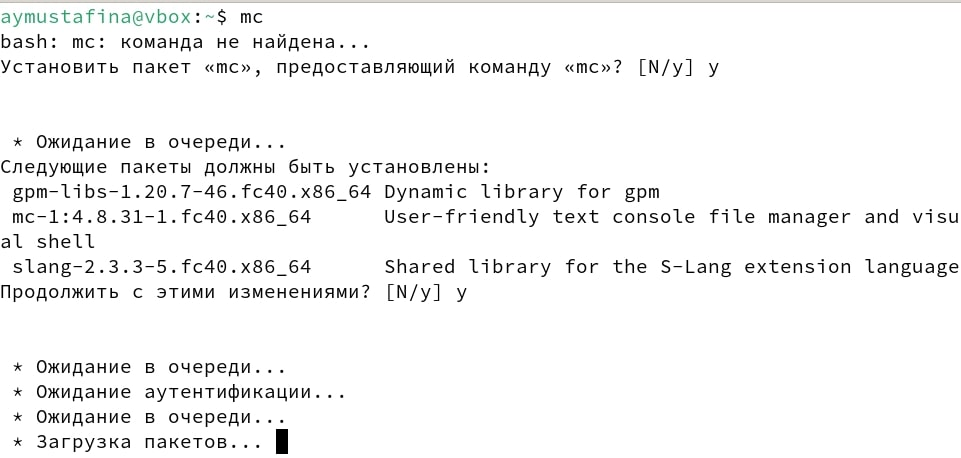

---
## Front matter
title: "Отчет по лабораторной работе №5"
subtitle: "Дисциплина: Архитектура компьютера"
author: "Мустафина Аделя Юрисовна"

## Generic otions
lang: ru-RU
toc-title: "Содержание"

## Bibliography
bibliography: bib/cite.bib
csl: pandoc/csl/gost-r-7-0-5-2008-numeric.csl

## Pdf output format
toc: true # Table of contents
toc-depth: 2
lof: true # List of figures
lot: true # List of tables
fontsize: 12pt
linestretch: 1.5
papersize: a4
documentclass: scrreprt
## I18n polyglossia
polyglossia-lang:
  name: russian
  options:
	- spelling=modern
	- babelshorthands=true
polyglossia-otherlangs:
  name: english
## I18n babel
babel-lang: russian
babel-otherlangs: english
## Fonts
mainfont: IBM Plex Serif
romanfont: IBM Plex Serif
sansfont: IBM Plex Sans
monofont: IBM Plex Mono
mathfont: STIX Two Math
mainfontoptions: Ligatures=Common,Ligatures=TeX,Scale=0.94
romanfontoptions: Ligatures=Common,Ligatures=TeX,Scale=0.94
sansfontoptions: Ligatures=Common,Ligatures=TeX,Scale=MatchLowercase,Scale=0.94
monofontoptions: Scale=MatchLowercase,Scale=0.94,FakeStretch=0.9
mathfontoptions:
## Biblatex
biblatex: true
biblio-style: "gost-numeric"
biblatexoptions:
  - parentracker=true
  - backend=biber
  - hyperref=auto
  - language=auto
  - autolang=other*
  - citestyle=gost-numeric
## Pandoc-crossref LaTeX customization
figureTitle: "Рис."
tableTitle: "Таблица"
listingTitle: "Листинг"
lofTitle: "Список иллюстраций"
lotTitle: "Список таблиц"
lolTitle: "Листинги"
## Misc options
indent: true
header-includes:
  - \usepackage{indentfirst}
  - \usepackage{float} # keep figures where there are in the text
  - \floatplacement{figure}{H} # keep figures where there are in the text
---

# Цель работы

Приобретение практических навыков работы в Midnight Commander. Освоение инструкций
языка ассемблера mov и int.

# Задание

1. Изучение программы Midnight Commander и выполнение кода на языке ассемблера NASM.
2. Выполнение самостоятельной работы.

# Теоретическое введение

Midnight Commander (или просто mc) — это программа, которая позволяет просматривать
структуру каталогов и выполнять основные операции по управлению файловой системой,
т.е. mc является файловым менеджером. Midnight Commander позволяет сделать работу с
файлами более удобной и наглядной.
Для активации оболочки Midnight Commander достаточно ввести в командной строке mc и
нажать клавишу Enter.
В Midnight Commander используются функциональные клавиши F1 — F10 , к которым
привязаны часто выполняемые операции.
Следующие комбинации клавиш облегчают работу с Midnight Commander:
• Tab используется для переключениями между панелями;
• ↑ и ↓ используется для навигации, Enter для входа в каталог или открытия файла
(если в файле расширений mc.ext заданы правила связи определённых расширений
файлов с инструментами их запуска или обработки);
• Ctrl + u (или через меню Команда > Переставить панели ) меняет местами содержимое
правой и левой панелей;
• Ctrl + o (или через меню Команда > Отключить панели ) скрывает или возвращает панели
Midnight Commander, за которыми доступен для работы командный интерпретатор
оболочки и выводимая туда информация.
• Ctrl + x + d (или через меню Команда > Сравнить каталоги ) позволяет сравнить содер-
жимое каталогов, отображаемых на левой и правой панелях.

Программа на языке ассемблера NASM, как правило, состоит из трёх секций: секция кода
программы (SECTION .text), секция инициированных (известных во время компиляции)
данных (SECTION .data) и секция неинициализированных данных (тех, под которые во
время компиляции только отводится память, а значение присваивается в ходе выполнения
программы) (SECTION .bss).

Таким образом, общая структура программы имеет следующий вид:

SECTION .data ; Секция содержит переменные, для
... ; которых задано начальное значение
SECTION .bss ; Секция содержит переменные, для
... ; которых не задано начальное значение
SECTION .text ; Секция содержит код программы
GLOBAL _start
_start: ; Точка входа в программу
... ; Текст программы
mov eax,1 ; Системный вызов для выхода (sys_exit)
mov ebx,0 ; Выход с кодом возврата 0 (без ошибок)
int 80h ; Вызов ядра
Для объявления инициированных данных в секции .data используются директивы DB, DW,
DD, DQ и DT, которые резервируют память и указывают, какие значения должны храниться в
этой памяти:
• DB (define byte) — определяет переменную размером в 1 байт;
• DW (define word) — определяет переменную размеров в 2 байта (слово);
• DD (define double word) — определяет переменную размером в 4 байта (двойное слово);
• DQ (define quad word) — определяет переменную размером в 8 байт (учетверённое слово);
• DT (define ten bytes) — определяет переменную размером в 10 байт.

# Выполнение лабораторной работы

## 5.3. Порядок выполнения лабораторной работы
Открываю Midnight Commander с помощью команды mc (рис. [-@fig:001]).

{#fig:001 width=70%}

Захожу в директорию ~/work/arch-pc (рис. [-@fig:002]).

{#fig:002 width=70%}

Создаю в этой директории папку с новым файлом с названием lab5-1.asm (рис. [-@fig:003]).

{#fig:003 width=70%}

Создание файла с помощью функции touch (рис. [-@fig:004]).

{#fig:004 width=70%}

Созданный файл (рис. [-@fig:005]).

{#fig:005 width=70%}

Открываю созданный файл с помощью функциональной клавиши F4 (рис. [-@fig:006]).

{#fig:006 width=70%}

Ввожу текст из листинга (рис. [-@fig:007]). 

{#fig:007 width=70%}

### Листинг 5.1. Программа вывода сообщения на экран и ввода строки с клавиатуры

;------------------------------------------------------------------
; Программа вывода сообщения на экран и ввода строки с клавиатуры
;------------------------------------------------------------------
;------------------- Объявление переменных ----------------

SECTION .data ; Секция инициированных данных
msg: DB 'Введите строку:',10 ; сообщение плюс
; символ перевода строки
msgLen: EQU $-msg ; Длина переменной 'msg'
SECTION .bss ; Секция не инициированных данных
buf1: RESB 80 ; Буфер размером 80 байт

;------------------- Текст программы -----------------
SECTION .text ; Код программы
GLOBAL _start ; Начало программы
_start: ; Точка входа в программу

;------------ Cистемный вызов `write`
; После вызова инструкции 'int 80h' на экран будет
; выведено сообщение из переменной 'msg' длиной 'msgLen'
mov eax,4 ; Системный вызов для записи (sys_write)
mov ebx,1 ; Описатель файла 1 - стандартный вывод
mov ecx,msg ; Адрес строки 'msg' в 'ecx'
mov edx,msgLen ; Размер строки 'msg' в 'edx'
int 80h ; Вызов ядра

;------------ системный вызов `read` ----------------------
; После вызова инструкции 'int 80h' программа будет ожидать ввода
; строки, которая будет записана в переменную 'buf1' размером 80 байт
mov eax, 3 ; Системный вызов для чтения (sys_read)
mov ebx, 0 ; Дескриптор файла 0 - стандартный ввод
mov ecx, buf1 ; Адрес буфера под вводимую строку
mov edx, 80 ; Длина вводимой строки
int 80h ; Вызов ядра

;------------ Системный вызов `exit` ----------------------
; После вызова инструкции 'int 80h' программа завершит работу
mov eax,1 ; Системный вызов для выхода (sys_exit)
mov ebx,0 ; Выход с кодом возврата 0 (без ошибок)
int 80h ; Вызов ядра

Убеждаюсь, что файл содержит текст программы (рис. [-@fig:008]). 

{#fig:008 width=70%}

Транслирую текст программы lab5-1.asm в объектный файл, выполняю компоновку объектного файла и запускаю его (рис. [-@fig:009]).

{#fig:009 width=70%}

Запуск файла (рис. [-@fig:010]).

{#fig:010 width=70%}

## 5.3.1. Подключение внешнего файла in_out.asm

Скопировала файл ab5-1.asm с именем lab5-2.asm (рис. [-@fig:011]). 

{#fig:011 width=70%}

Я скачала файл in_out.asm со страницы курса в ТУИС и переместила его в каталог с программами лабораторной работы (рис. [-@fig:012]).

{#fig:012 width=70%}

Меняю текст в программе lab5-2.asm в соответствии с листингом 5.2 (рис. [-@fig:013]).

{#fig:013 width=70%}

Транслирую текст программы lab5-2.asm в объектный файл, выполняю компоновку объектного файла (рис. [-@fig:014]).

{#fig:014 width=70%}

### Листинг 5.2. Программа вывода сообщения на экран и ввода строки с клавиатуры c использованием файла in_out.asm

;--------------------------------------------------------------------
; Программа вывода сообщения на экран и ввода строки с клавиатуры
;---------------------------------------------------------------------

%include 'in_out.asm' ; подключение внешнего файла
SECTION .data ; Секция инициированных данных
msg: DB 'Введите строку: ',0h ; сообщение

SECTION .bss ; Секция не инициированных данных
buf1: RESB 80 ; Буфер размером 80 байт

SECTION .text ; Код программы
GLOBAL _start ; Начало программы
_start: ; Точка входа в программу
mov eax, msg ; запись адреса выводимого сообщения в `EAX`
call sprintLF ; вызов подпрограммы печати сообщения
mov ecx, buf1 ; запись адреса переменной в `EAX`
mov edx, 80 ; запись длины вводимого сообщения в `EBX`

call sread ; вызов подпрограммы ввода сообщения
call quit ; вызов подпрограммы завершения 

Запуск программы lab5-2.asm (рис. [-@fig:015]).

{#fig:015 width=70%}

Меняю текст в программе lab5-2.asm, заменив подпрограмму sprintLF на sprint (рис. [-@fig:016]).

{#fig:016 width=70%}

### Листинг 5.3. Измененная программа вывода сообщения на экран и ввода строки с клавиатуры с использованием файла in_out.asm

;--------------------------------------------------------------------
; Измененная программа вывода сообщения на экран и ввода строки с клавиатуры
;---------------------------------------------------------------------

%include 'in_out.asm' ; подключение внешнего файла
SECTION .data ; Секция инициированных данных
msg: DB 'Введите строку: ',0h ; сообщение

SECTION .bss ; Секция не инициированных данных
buf1: RESB 80 ; Буфер размером 80 байт

SECTION .text ; Код программы
GLOBAL _start ; Начало программы
_start: ; Точка входа в программу
mov eax, msg ; запись адреса выводимого сообщения в `EAX`
call sprint ; вызов подпрограммы печати сообщения
mov ecx, buf1 ; запись адреса переменной в `EAX`
mov edx, 80 ; запись длины вводимого сообщения в `EBX`

call sread ; вызов подпрограммы ввода сообщения
call quit ; вызов подпрограммы завершения 

Запуск измененной программы lab5-2.asm (рис. [-@fig:017]).

{#fig:017 width=70%}

Разница между этими исполняемыми файлами заключается в том, что в первом варианте при запуске запрашивается ввод с новой строки,
а во втором при запуске ввод происходит без перехода на новую строку.

# Выполнение заданий для самостоятельной работы

## 1.

Создаю копию файла lab5-1.asm с названием lab5-1-1.asm (рис. [-@fig:018]).

{#fig:018 width=70%}

И вношу изменения в эту программу такие, что при запуске она выводит приглашение и просит ввести строку с клавиатуры, 
а после снова выводит введенную пользователем строку (рис. [-@fig:019]).

{#fig:019 width=70%}

### Листинг для первой программы для самостоятельной работы

;------------------------------------------------------------------
; Программа вывода сообщения на экран и ввода строки с клавиатуры
;------------------------------------------------------------------
;------------------- Объявление переменных ----------------

SECTION .data ; Секция инициированных данных
msg: DB 'Введите строку:',10 ; сообщение плюс
; символ перевода строки
msgLen: EQU $-msg ; Длина переменной 'msg'
SECTION .bss ; Секция не инициированных данных
buf1: RESB 80 ; Буфер размером 80 байт

;------------------- Текст программы -----------------
SECTION .text ; Код программы
GLOBAL _start ; Начало программы
_start: ; Точка входа в программу

;------------ Cистемный вызов `write`
; После вызова инструкции 'int 80h' на экран будет
; выведено сообщение из переменной 'msg' длиной 'msgLen'

mov eax,4 ; Системный вызов для записи (sys_write)
mov ebx,1 ; Описатель файла 1 - стандартный вывод
mov ecx,msg ; Адрес строки 'msg' в 'ecx'
mov edx,msgLen ; Размер строки 'msg' в 'edx'
int 80h ; Вызов ядра
;------------ системный вызов `read` ----------------------
; После вызова инструкции 'int 80h' программа будет ожидать ввода
; строки, которая будет записана в переменную 'buf1' размером 80 байт

mov eax, 3 ; Системный вызов для чтения (sys_read)
mov ebx, 0 ; Дескриптор файла 0 - стандартный ввод
mov ecx, buf1 ; Адрес буфера под вводимую строку
mov edx, 80 ; Длина вводимой строки
int 80h ; Вызов ядра

mov eax, 4;
mov ebx, 1;
mov ecx, buf1;
mov edx, buf1;
int 80h;

;------------ Системный вызов `exit` ----------------------
; После вызова инструкции 'int 80h' программа завершит работу

mov eax,1 ; Системный вызов для выхода (sys_exit)
mov ebx,0 ; Выход с кодом возврата 0 (без ошибок)
int 80h ; Вызов ядра

## 2.

Создаю копию файла lab5-2.asm с названием lab5-2-1.asm (рис. [-@fig:020]).

{#fig:020 width=70%}

И вношу изменения в эту программу такие, что при запуске она выводит приглашение и просит ввести строку с клавиатуры, 
а после снова выводит введенную пользователем строку без перехода на новую строку (рис. [-@fig:021]).

{#fig:021 width=70%}

Запуск программы lab5-2-1.asm (рис. [-@fig:022]).

{#fig:022 width=70%}

### Листинг для второй программы для самостоятельной работы

;--------------------------------------------------------------------
; Программа вывода сообщения на экран и ввода строки с клавиатуры
;---------------------------------------------------------------------

%include 'in_out.asm' ; подключение внешнего файла
SECTION .data ; Секция инициированных данных
msg: DB 'Введите строку: ',0h ; сообщение
SECTION .bss ; Секция не инициированных данных
buf1: RESB 80 ; Буфер размером 80 байт
SECTION .text ; Код программы
GLOBAL _start ; Начало программы
_start: ; Точка входа в программу
mov eax, msg ; запись адреса выводимого сообщения в `EAX`
call sprint ; вызов подпрограммы печати сообщения
mov ecx, buf1 ; запись адреса переменной в `EAX`
mov edx, 80 ; запись длины вводимого сообщения в `EBX`
call sread ; вызов подпрограммы ввода сообщения

mov eax, 4;
mov ebx, 1;
mov ecx, buf1;
int 80h;

call quit ; вызов подпрограммы завершения

# Выводы

При выполнении лабораторной работы я научилась работать в Midnight Commander. И изучила основы программ для вывода и ввода 
на языке ассемблера. 

# Список литературы

1. [Лабораторная работа №6](https://esystem.rudn.ru/pluginfile.php/2089085/mod_resource/content/0/%D0%9B%D0%B0%D0%B1%D0%BE%D1%80%D0%B0%D1%82%D0%BE%D1%80%D0%BD%D0%B0%D1%8F%20%D1%80%D0%B0%D0%B1%D0%BE%D1%82%D0%B0%20%E2%84%965.%20%D0%9E%D1%81%D0%BD%D0%BE%D0%B2%D1%8B%20%D1%80%D0%B0%D0%B1%D0%BE%D1%82%D1%8B%20%D1%81%20Midnight%20Commander%20%28%29.%20%D0%A1%D1%82%D1%80%D1%83%D0%BA%D1%82%D1%83%D1%80%D0%B0%20%D0%BF%D1%80%D0%BE%D0%B3%D1%80%D0%B0%D0%BC%D0%BC%D1%8B%20%D0%BD%D0%B0%20%D1%8F%D0%B7%D1%8B%D0%BA%D0%B5%20%D0%B0%D1%81%D1%81%D0%B5%D0%BC%D0%B1%D0%BB%D0%B5%D1%80%D0%B0%20NASM.%20%D0%A1%D0%B8%D1%81%D1%82%D0%B5%D0%BC%D0%BD%D1%8B%D0%B5%20%D0%B2%D1%8B%D0%B7%D0%BE%D0%B2%D1%8B%20%D0%B2%20%D0%9E%D0%A1%20GNU%20Linux.pdf)
