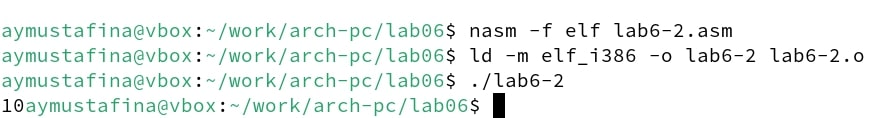

---
## Front matter
title: "Отчет по лабораторной работе №6"
subtitle: "Дисциплина: Архитектура компьютера"
author: "Мустафина Аделя Юрисовна"

## Generic otions
lang: ru-RU
toc-title: "Содержание"

## Bibliography
bibliography: bib/cite.bib
csl: pandoc/csl/gost-r-7-0-5-2008-numeric.csl

## Pdf output format
toc: true # Table of contents
toc-depth: 2
lof: true # List of figures
lot: true # List of tables
fontsize: 12pt
linestretch: 1.5
papersize: a4
documentclass: scrreprt
## I18n polyglossia
polyglossia-lang:
  name: russian
  options:
	- spelling=modern
	- babelshorthands=true
polyglossia-otherlangs:
  name: english
## I18n babel
babel-lang: russian
babel-otherlangs: english
## Fonts
mainfont: IBM Plex Serif
romanfont: IBM Plex Serif
sansfont: IBM Plex Sans
monofont: IBM Plex Mono
mathfont: STIX Two Math
mainfontoptions: Ligatures=Common,Ligatures=TeX,Scale=0.94
romanfontoptions: Ligatures=Common,Ligatures=TeX,Scale=0.94
sansfontoptions: Ligatures=Common,Ligatures=TeX,Scale=MatchLowercase,Scale=0.94
monofontoptions: Scale=MatchLowercase,Scale=0.94,FakeStretch=0.9
mathfontoptions:
## Biblatex
biblatex: true
biblio-style: "gost-numeric"
biblatexoptions:
  - parentracker=true
  - backend=biber
  - hyperref=auto
  - language=auto
  - autolang=other*
  - citestyle=gost-numeric
## Pandoc-crossref LaTeX customization
figureTitle: "Рис."
tableTitle: "Таблица"
listingTitle: "Листинг"
lofTitle: "Список иллюстраций"
lotTitle: "Список таблиц"
lolTitle: "Листинги"
## Misc options
indent: true
header-includes:
  - \usepackage{indentfirst}
  - \usepackage{float} # keep figures where there are in the text
  - \floatplacement{figure}{H} # keep figures where there are in the text
---

# Цель работы

Освоение арифметических инструкций языка ассемблера NASM.

# Задание

1. Порядок выполнения лабораторной работы.
2. Выполнение заданий для самостоятельной работы.

# Теоретическое введение

## 6.2.1. Адресация в NASM
Большинство инструкций на языке ассемблера требуют обработки операндов. Адрес опе-
ранда предоставляет место, где хранятся данные, подлежащие обработке. Это могут быть
данные хранящиеся в регистре или в ячейке памяти. Далее рассмотрены все существующие
способы задания адреса хранения операндов – способы адресации.
Существует три основных способа адресации:
• Регистровая адресация – операнды хранятся в регистрах и в команде используются
имена этих регистров, например: mov ax,bx.
• Непосредственная адресация – значение операнда задается непосредственно в ко-
манде, Например: mov ax,2.
• Адресация памяти – операнд задает адрес в памяти. В команде указывается символи-
ческое обозначение ячейки памяти, над содержимым которой требуется выполнить
операцию.
Например, определим переменную intg DD 3 – это означает, что задается область памяти
размером 4 байта, адрес которой обозначен меткой intg. В таком случае, команда
mov eax,[intg]
копирует из памяти по адресу intg данные в регистр eax. В свою очередь команда
mov [intg],eax
запишет в память по адресу intg данные из регистра eax.
Также рассмотрим команду
mov eax,intg
В этом случае в регистр eax запишется адрес intg. Допустим, для intg выделена память
начиная с ячейки с адресом 0x600144, тогда команда mov eax,intg аналогична команде mov
eax,0x600144 – т.е. эта команда запишет в регистр eax число 0x600144.

## 6.2.2. Арифметические операции в NASM

### 6.2.2.1. Целочисленное сложение add.
Схема команды целочисленного сложения add (от англ. addition - добавление) выполняет
сложение двух операндов и записывает результат по адресу первого операнда. Команда add
работает как с числами со знаком, так и без знака и выглядит следующим образом:
add <операнд_1>, <операнд_2>
Допустимые сочетания операндов для команды add аналогичны сочетаниям операндов
для команды mov.
Так, например, команда add eax,ebx прибавит значение из регистра eax к значению из
регистра ebx и запишет результат в регистр eax.
Примеры:
add ax,5 ; AX = AX + 5
add dx,cx ; DX = DX + CX
add dx,cl ; Ошибка: разный размер операндов.

### 6.2.2.2. Целочисленное вычитание sub.
Команда целочисленного вычитания sub (от англ. subtraction – вычитание) работает анало-
гично команде add и выглядит следующим образом:
sub <операнд_1>, <операнд_2>
Так, например, команда sub ebx,5 уменьшает значение регистра ebx на 5 и записывает
результат в регистр ebx.

### 6.2.2.3. Команды инкремента и декремента.
Довольно часто при написании программ встречается операция прибавления или вычита-
ния единицы. Прибавление единицы называется инкрементом, а вычитание — декрементом.
Для этих операций существуют специальные команды: inc (от англ. increment) и dec (от англ.
decrement), которые увеличивают и уменьшают на 1 свой операнд.
Эти команды содержат один операнд и имеет следующий вид:
inc <операнд>
dec <операнд>
Операндом может быть регистр или ячейка памяти любого размера. Команды инкремента
и декремента выгодны тем, что они занимают меньше места, чем соответствующие команды
сложения и вычитания.
Так, например, команда inc ebx увеличивает значение регистра ebx на 1, а команда inc
ax уменьшает значение регистра ax на 1.

### 6.2.2.4. Команда изменения знака операнда neg.
Еще одна команда, которую можно отнести к арифметическим командам это команда
изменения знака neg:
neg <операнд>
Команда neg рассматривает свой операнд как число со знаком и меняет знак операнда на
противоположный. Операндом может быть регистр или ячейка памяти любого размера.
mov ax,1 ; AX = 1
neg ax ; AX = -1

### 6.2.2.5. Команды умножения mul и imul.
Умножение и деление, в отличии от сложения и вычитания, для знаковых и беззнаковых
чисел производиться по-разному, поэтому существуют различные команды.
Для беззнакового умножения используется команда mul (от англ. multiply – умножение):
mul <операнд>
Для знакового умножения используется команда imul:
imul <операнд>
Для команд умножения один из сомножителей указывается в команде и должен нахо-
диться в регистре или в памяти, но не может быть непосредственным операндом. Второй
сомножитель в команде явно не указывается и должен находиться в регистре EAX,AX или
AL, а результат помещается в регистры EDX:EAX, DX:AX или AX, в зависимости от размера
операнда 6.1.

### 6.2.2.6. Команды деления div и idiv.
Для деления, как и для умножения, существует 2 команды div (от англ. divide - деление) и
idiv:
div <делитель> ; Беззнаковое деление
idiv <делитель> ; Знаковое деление
В командах указывается только один операнд – делитель, который может быть регистром
или ячейкой памяти, но не может быть непосредственным операндом. Местоположение
делимого и результата для команд деления зависит от размера делителя. Кроме того, так как
в результате деления получается два числа – частное и остаток, то эти числа помещаются в
определённые регистры 6.2.
## 6.2.3. Перевод символа числа в десятичную символьную запись
Ввод информации с клавиатуры и вывод её на экран осуществляется в символьном виде.
Кодирование этой информации производится согласно кодовой таблице символов ASCII.
ASCII – сокращение от American Standard Code for Information Interchange (Американский
стандартный код для обмена информацией). Согласно стандарту ASCII каждый символ
кодируется одним байтом.
Расширенная таблица ASCII состоит из двух частей. Первая (символы с кодами 0-127)
является универсальной (см. Приложение.), а вторая (коды 128-255) предназначена для
специальных символов и букв национальных алфавитов и на компьютерах разных типов
может меняться.
Среди инструкций NASM нет такой, которая выводит числа (не в символьном виде). По-
этому, например, чтобы вывести число, надо предварительно преобразовать его цифры в
ASCII-коды этих цифр и выводить на экран эти коды, а не само число. Если же выводить число
на экран непосредственно, то экран воспримет его не как число, а как последовательность
ASCII-символов – каждый байт числа будет воспринят как один ASCII-символ – и выведет на
экран эти символы.
Аналогичная ситуация происходит и при вводе данных с клавиатуры. Введенные дан-
ные будут представлять собой символы, что сделает невозможным получение корректного
результата при выполнении над ними арифметических операций.
Для решения этой проблемы необходимо проводить преобразование ASCII символов в
числа и обратно.
Для выполнения лабораторных работ в файле in_out.asm реализованы подпрограммы
для преобразования ASCII символов в числа и обратно. Это:
• iprint – вывод на экран чисел в формате ASCII, перед вызовом iprint в регистр eax
необходимо записать выводимое число (mov eax,<int>).
• iprintLF – работает аналогично iprint, но при выводе на экран после числа добавляет
к символ перевода строки.
• atoi – функция преобразует ascii-код символа в целое число и записает результат
в регистр eax, перед вызовом atoi в регистр eax необходимо записать число (mov
eax,<int>).

# Выполнение лабораторной работы
## 6.3.1. Символьные и численные данные в NASM
Создаю каталог для программ лабораторной работы №6 (рис. [-@fig:001]).

{#fig:001 width=70%}

Открываю созданный файл (рис. [-@fig:002]).

{#fig:002 width=70%}

Ввожу текст из листинга 6.1 (рис. [-@fig:003]).

{#fig:003 width=70%}

Листинг 6.1. Программа вывода значения регистра eax
``` 
%include 'in_out.asm'
SECTION .bss
buf1: RESB 80
SECTION .text
GLOBAL _start
_start:
mov eax,'6'
mov ebx,'4'
add eax,ebx
mov [buf1],eax
mov eax,buf1
call sprintLF
call quit
```
Создаю исполняемый файл (рис. [-@fig:004]).

{#fig:004 width=70%}

Запускаю его и вижу вывод буквы j, хотя мы ожидали увидеть число 10, это произошло из-за того, что команда add eax,ebx записала в регистр eax сумму кодов – 01101010, так через таблицу ASCII мы получаем j (рис. [-@fig:005]).

{#fig:005 width=70%}

Теперь изменим наш код программы, убрав кавычки возле чисел (рис. [-@fig:006]).

{#fig:006 width=70%}

Создам исполняемый файл (рис. [-@fig:007]).

{#fig:007 width=70%}

При запуске программы получаем пустую строчку, так мы получили символ с кодом 10. Пользуясь таблицей ASCII, видим, что код числа 10 это "LF" ,а они обозначают начало новой строки, теперь понятно, почему нам вывело пустую строку (рис. [-@fig:008]).

{#fig:008 width=70%}

Создаю новый файл с названием lab6-2.asm в каталоге ~/work/arch-pc/lab06 (рис. [-@fig:009]).

{#fig:009 width=70%}

Ввожу в него текст программы из листинга 6.2. (рис. [-@fig:010]).

{#fig:010 width=70%}

Листинг 6.2. Программа вывода значения регистра eax
``` 
%include 'in_out.asm'
SECTION .text
GLOBAL _start
_start:
mov eax,'6'
mov ebx,'4'
add eax,ebx
call iprintLF
call quit
```

Создаю исполняемый файл (рис. [-@fig:011]).

{#fig:011 width=70%}

Запускаю его функция iprintLF позволяет вывести число, а не символ, кодом которого
является это число, поэтому мы получили число 106 (рис. [-@fig:012]).

{#fig:012 width=70%}

Снова изменим пару строк в тесте программы, убрав кавычки (рис. [-@fig:013]).

{#fig:013 width=70%}

После создания исполняемого файла запускаю его и получаю 10 (рис. [-@fig:014]).

{#fig:014 width=70%}

Теперь снова меняю строки в коде, заменив функцию iprintLF на iprint (рис. [-@fig:015]).

{#fig:015 width=70%}

В выводе получаю число 10 без перехода на новую строку и все слиплось, так произошло из-за того, что мы убрали символ LF, который и делал пропуск строки. (рис. [-@fig:016]).

{#fig:016 width=70%}

## 6.3.2. Выполнение арифметических операций в NASM

В качестве примера выполнения арифметических операций в NASM приведу про-
грамму вычисления арифметического выражения f(x) = (5 * 2 + 3)/3.
Создаю файл lab6-3.asm в каталоге ~/work/arch-pc/lab06:
touch ~/work/arch-pc/lab06/lab6-3.asm
И ввожу текст программы из листинга 6.3 (рис. [-@fig:017]).

{#fig:017 width=70%}

Листинг 6.3. Программа вычисления выражения f(x) = (5 * 2 + 3)/3.
```
;--------------------------------
; Программа вычисления выражения
;--------------------------------
%include 'in_out.asm' ; подключение внешнего файла
SECTION .data
div: DB 'Результат: ',0
rem: DB 'Остаток от деления: ',0
SECTION .text
GLOBAL _start
_start:
; ---- Вычисление выражения
mov eax,5 ; EAX=5
mov ebx,2 ; EBX=2
mul ebx ; EAX=EAX*EBX
add eax,3 ; EAX=EAX+3
xor edx,edx ; обнуляем EDX для корректной работы div
mov ebx,3 ; EBX=3
div ebx ; EAX=EAX/3, EDX=остаток от деления
mov edi,eax ; запись результата вычисления в 'edi'
; ---- Вывод результата на экран
mov eax,div ; вызов подпрограммы печати
call sprint ; сообщения 'Результат: '
mov eax,edi ; вызов подпрограммы печати значения
call iprintLF ; из 'edi' в виде символов
mov eax,rem ; вызов подпрограммы печати
call sprint ; сообщения 'Остаток от деления: '
mov eax,edx ; вызов подпрограммы печати значения
call iprintLF ; из 'edx' (остаток) в виде символов
call quit ; вызов подпрограммы завершения
```
Создаю исполняемый файл и запускаю его (рис. [-@fig:018]).

{#fig:018 width=70%}

Изменяю текст программы для вычисления выражения f(x) = (4 * 6 + 2)/5 (рис. [-@fig:019]).

{#fig:019 width=70%}

Создаю исполняемый файл и проверяю его работу (рис. [-@fig:020]).

{#fig:020 width=70%}

Создаю файл variant.asm в каталоге ~/work/arch-pc/lab06:
touch ~/work/arch-pc/lab06/variant.asm 
Проверила результат работы программы, вычислив номер варианта аналитически и получаю номер варианта 20 (рис. [-@fig:021]).

{#fig:021 width=70%}

Текст файла из листинга 6.4 (рис. [-@fig:022]).

{#fig:022 width=70%}

Листинг 6.4 Программа вычисления вычисления варианта задания по номеру
студенческого билета
```
;--------------------------------
; Программа вычисления варианта
;--------------------------------
%include 'in_out.asm'
SECTION .data
msg: DB 'Введите № студенческого билета: ',0
rem: DB 'Ваш вариант: ',0
SECTION .bss
x: RESB 80
SECTION .text
GLOBAL _start
_start:
mov eax, msg
call sprintLF
mov ecx, x
mov edx, 80
call sread
mov eax,x ; вызов подпрограммы преобразования
call atoi ; ASCII кода в число, `eax=x`
xor edx,edx
mov ebx,20
div ebx
inc edx
mov eax,rem
call sprint
mov eax,edx
call iprintLF
call quit
```
Ответы на вопросы из лекции.
1. За вывод на экран сообщения "Ваш вариант:" отвечают строки:
```
mov eax,rem         ; вызов подпрограммы печати сообщения "Ваш вариант:"
call sprint
```
2. Данные инструкции используются для чтения 80 байтов данных из ввода и сохранения их по адресу, указанном в x.
В данной программе в регистр ecx записывается символ x (mov ecx. x), в регистр edx значение 80 (mov edx, 80), это значение используется для указания количества байтов.
```
mov ecx, x
mov edx, 80
call sread
```
3. Эта инструкция используется для преобразования SCII кода в число, `eax=x`. 
```
call atoi
```
4. За вычисление варианта отвечают строки:
```
xor edx,edx   ; Обнуляем EDX для корректной работы div
mov ebx,20    ; Задали для ebx значение 20
div ebx       ; AX=EAX/20, EDX=остаток от деления
inc edx       ; edx + 1
```
5. Остаток от деления при выполнении инструкции “div ebx” записывается в регистр EDX.
6. Инструкция “inc edx” используется для увеличения значения edx на 1( edx + 1).
7. За вывод результата вычислений отвечают строки:
```
mov eax,edx ; вызов подпрограммы печати значения
call iprintLF ; из 'edx' (остаток) в виде символов
```

## 6.4. Задание для самостоятельной работы
Вводим текст программы для вычисления выражения y = f(x). В предыдущем задании мы получили № нашего варианта - 20. Значит пишем программу вычисления выражения y = x^3 * 1/3 + 21 (рис. [-@fig:023]).

{#fig:023 width=70%}

Компилирую созданный файл (рис. [-@fig:024]).

{#fig:024 width=70%}

Запускаю его (рис. [-@fig:025]).

{#fig:025 width=70%}

## Листинг для задания для самостоятельной работы
```
;--------------------------------
; Программа вычисления выражения
;--------------------------------
%include 'in_out.asm' ; подключение внешнего файла
SECTION .data
msg: DB 'Введите значение для переменной x: ',0
rem: DB 'Результат: ',0
SECTION .bss
x: RESB 80; переменная
SECTION .text
GLOBAL _start
_start:
; ---- Вычисление выражения

mov eax, msg
call sprintLF

mov ecx, x
mov edx, 80
call sread
mov eax,x ; вызов подпрограммы преобразования
call atoi ; ASCII кода в число, `eax=x

mov ebx, eax
mul eax     ;x^3
mul ebx      ; перемножили х для получения куба
xor ebx, ebx          ;Обнуляем для корректного деления
mov ebx, 3     ; 

div ebx        ;x^3 / 3 делим
xor ebx, ebx
add eax, 21     ;x^3 / 3 + 21 прибавляем

mov edi,eax     ;
; ---- Вывод результата на экран


mov eax,rem ; вызов подпрограммы печати
call sprint ; сообщения 'Результат: '
mov eax,edi ; вызов подпрограммы печати значения
call iprint ; из 'edi' в виде символов
call quit ; вызов подпрограммы завершения
```

# Выводы

В ходе выполнения лабораторной работы мы научились работать с арифметическими инструкциями языка ассемблера NASM.

# Список литературы

1. [Лабораторная работа №6](https://esystem.rudn.ru/pluginfile.php/2089086/mod_resource/content/0/%D0%9B%D0%B0%D0%B1%D0%BE%D1%80%D0%B0%D1%82%D0%BE%D1%80%D0%BD%D0%B0%D1%8F%20%D1%80%D0%B0%D0%B1%D0%BE%D1%82%D0%B0%20%E2%84%966.%20%D0%90%D1%80%D0%B8%D1%84%D0%BC%D0%B5%D1%82%D0%B8%D1%87%D0%B5%D1%81%D0%BA%D0%B8%D0%B5%20%D0%BE%D0%BF%D0%B5%D1%80%D0%B0%D1%86%D0%B8%D0%B8%20%D0%B2%20NASM..pdf)
