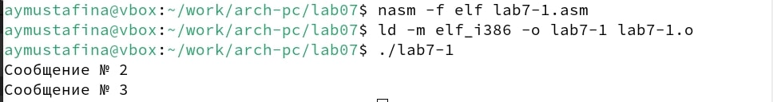
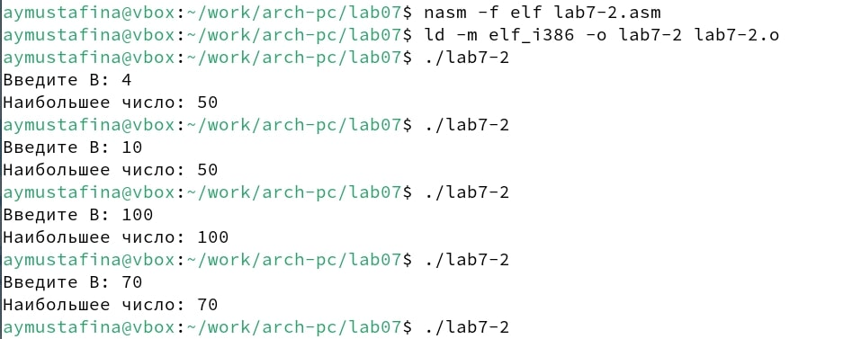

---
## Front matter
title: "Отчет по лабораторной работе №7"
subtitle: "Дисциплина: Архитектура компьютера"
author: "Мустафина Аделя Юрисовна"

## Generic otions
lang: ru-RU
toc-title: "Содержание"

## Bibliography
bibliography: bib/cite.bib
csl: pandoc/csl/gost-r-7-0-5-2008-numeric.csl

## Pdf output format
toc: true # Table of contents
toc-depth: 2
lof: true # List of figures
lot: true # List of tables
fontsize: 12pt
linestretch: 1.5
papersize: a4
documentclass: scrreprt
## I18n polyglossia
polyglossia-lang:
  name: russian
  options:
	- spelling=modern
	- babelshorthands=true
polyglossia-otherlangs:
  name: english
## I18n babel
babel-lang: russian
babel-otherlangs: english
## Fonts
mainfont: IBM Plex Serif
romanfont: IBM Plex Serif
sansfont: IBM Plex Sans
monofont: IBM Plex Mono
mathfont: STIX Two Math
mainfontoptions: Ligatures=Common,Ligatures=TeX,Scale=0.94
romanfontoptions: Ligatures=Common,Ligatures=TeX,Scale=0.94
sansfontoptions: Ligatures=Common,Ligatures=TeX,Scale=MatchLowercase,Scale=0.94
monofontoptions: Scale=MatchLowercase,Scale=0.94,FakeStretch=0.9
mathfontoptions:
## Biblatex
biblatex: true
biblio-style: "gost-numeric"
biblatexoptions:
  - parentracker=true
  - backend=biber
  - hyperref=auto
  - language=auto
  - autolang=other*
  - citestyle=gost-numeric
## Pandoc-crossref LaTeX customization
figureTitle: "Рис."
tableTitle: "Таблица"
listingTitle: "Листинг"
lofTitle: "Список иллюстраций"
lotTitle: "Список таблиц"
lolTitle: "Листинги"
## Misc options
indent: true
header-includes:
  - \usepackage{indentfirst}
  - \usepackage{float} # keep figures where there are in the text
  - \floatplacement{figure}{H} # keep figures where there are in the text
---

# Цель работы

Изучение команд условного и безусловного переходов. Приобретение навыков написания
программ с использованием переходов. Знакомство с назначением и структурой файла
листинга.

# Задание

1. Выполнение лабораторной работы
2. Выполнение заданий для самостоятельной работы

# Теоретическое введение

Для реализации ветвлений в ассемблере используются так называемые команды передачи
управления или команды перехода. Можно выделить 2 типа переходов:
• условный переход – выполнение или не выполнение перехода в определенную точку
программы в зависимости от проверки условия.
• безусловный переход – выполнение передачи управления в определенную точку программы без каких-либо условий.

## 7.2.1. Команды безусловного перехода
Безусловный переход выполняется инструкцией jmp (от англ. jump – прыжок), которая
включает в себя адрес перехода, куда следует передать управление:

jmp <адрес_перехода>
Адрес перехода может быть либо меткой, либо адресом области памяти, в которую предварительно помещен указатель перехода. Кроме того, в качестве операнда можно использовать
имя регистра, в таком случае переход будет осуществляться по адресу, хранящемуся в этом
регистре.

## 7.2.1. Команды безусловного перехода
Безусловный переход выполняется инструкцией jmp (от англ. jump – прыжок), которая включает в себя адрес перехода, куда следует передать управление:
jmp <адрес_перехода>
Адрес перехода может быть либо меткой, либо адресом области памяти, в которую предварительно помещен указатель перехода. Кроме того, в качестве операнда можно использовать имя регистра, в таком случае переход будет осуществляться по адресу, хранящемуся в этом регистре.

## 7.2.2.1. Регистр флагов
Флаг – это бит, принимающий значение 1 («флаг установлен»), если выполнено некоторое условие, и значение 0 («флаг сброшен») в противном случае. Флаги работают независимо друг от друга, и лишь для удобства они помещены в единый регистр — регистр флагов, отражающий текущее состояние процессора. В следующей таблице указано положение битовых
флагов в регистре флагов.

## 7.2.2.2. Описание инструкции cmp
Инструкция cmp является одной из инструкций, которая позволяет сравнить операнды и выставляет флаги в зависимости от результата сравнения.
Инструкция cmp является командой сравнения двух операндов и имеет такой же формат, как и команда вычитания:

cmp <операнд_1>, <операнд_2>
Команда cmp, так же как и команда вычитания, выполняет вычитание <операнд_2> -
<операнд_1>, но результат вычитания никуда не записывается и единственным результатом
команды сравнения является формирование флагов.

## 7.2.2.3. Описание команд условного перехода.
Команда условного перехода имеет вид
j<мнемоника перехода> label
Мнемоника перехода связана со значением анализируемых флагов или со способом формирования этих флагов.
В их мнемокодах указывается тот результат сравнения, при котором
надо делать переход. Мнемоники, идентичные по своему действию, написаны в таблице через дробь (например, ja и jnbe). Программист выбирает, какую из них применить, чтобы получить более простой для понимания текст программы.

## 7.2.3. Файл листинга и его структура
Листинг (в рамках понятийного аппарата NASM) — это один из выходных файлов, создаваемых транслятором. Он имеет текстовый вид и нужен при отладке программы, так как кроме строк самой программы он содержит дополнительную информацию.
Ниже приведён фрагмент файла листинга.

10 00000000 B804000000 mov eax,4
11 00000005 BB01000000 mov ebx,1
12 0000000A B9[00000000] mov ecx,hello
13 0000000F BA0D000000 mov edx,helloLen
14
15 00000014 CD80 int 80h

Все ошибки и предупреждения, обнаруженные при ассемблировании, транслятор выводит на экран, и файл листинга не создаётся.
Итак, структура листинга:
• номер строки — это номер строки файла листинга (нужно помнить, что номер строки в файле листинга может не соответствовать номеру строки в файле с исходным текстом программы);
• адрес — это смещение машинного кода от начала текущего сегмента;
• машинный код представляет собой ассемблированную исходную строку в виде шестна-
дцатеричной последовательности. (например, инструкция int 80h начинается по сме-
щению 00000020 в сегменте кода; далее идёт машинный код, в который ассемблируется
инструкция, то есть инструкция int 80h ассемблируется в CD80 (в шестнадцатеричном
представлении); CD80 — это инструкция на машинном языке, вызывающая прерывание
ядра);
• исходный текст программы — это просто строка исходной программы вместе с комментариями (некоторые строки на языке ассемблера, например, строки, содержащие
только комментарии, не генерируют никакого машинного кода, и поля «смещение» и
«исходный текст программы» в таких строках отсутствуют, однако номер строки им
присваивается).

# Выполнение лабораторной работы

Создаю каталог для программ лабораторной работы №7 и создаю там файл(рис. [-@fig:001]).

{#fig:001 width=70%}

Заполняю файл с помощью листинга 7.1 с использованием инструкции jmp(рис. [-@fig:002]).

{#fig:002 width=70%}

Листинг 7.1. Программа с использованием инструкции jmp:
```
%include 'in_out.asm' ; подключение внешнего файла
SECTION .data
msg1: DB 'Сообщение № 1',0
msg2: DB 'Сообщение № 2',0
msg3: DB 'Сообщение № 3',0
SECTION .text
GLOBAL _start
_start:
jmp _label2
_label1:
mov eax, msg1 ; Вывод на экран строки
call sprintLF ; 'Сообщение № 1'
_label2:
mov eax, msg2 ; Вывод на экран строки
call sprintLF ; 'Сообщение № 2'
_label3:
mov eax, msg3 ; Вывод на экран строки
call sprintLF ; 'Сообщение № 3'
_end:
call quit ; вызов подпрограммы завершения
```
Создаю исполняемый файл и запускаю его(рис. [-@fig:003]).

{#fig:003 width=70%}

Таким образом, использование инструкции jmp _label2 меняет порядок исполнения
инструкций и позволяет выполнить инструкции начиная с метки _label2, пропустив вывод
первого сообщения.
Инструкция jmp позволяет осуществлять переходы не только вперед но и назад. Изменим
программу таким образом, чтобы она выводила сначала ‘Сообщение № 2’, потом ‘Сообщение
№ 1’ и завершала работу. Для этого в текст программы после вывода сообщения № 2 добавим
инструкцию jmp с меткой _label1 (т.е. переход к инструкциям вывода сообщения № 1)
и после вывода сообщения № 1 добавим инструкцию jmp с меткой _end (т.е. переход к
инструкции call quit). Измените текст программы в соответствии с листингом 7.2.

Листинг 7.2. Программа с использованием инструкции jmp:
```
%include 'in_out.asm' ; подключение внешнего файла
SECTION .data
msg1: DB 'Сообщение № 1',0
msg2: DB 'Сообщение № 2',0
msg3: DB 'Сообщение № 3',0
SECTION .text
GLOBAL _start
_start:
jmp _label2
_label1:
mov eax, msg1 ; Вывод на экран строки
call sprintLF ; 'Сообщение № 1'
jmp _end
_label2:
mov eax, msg2 ; Вывод на экран строки
call sprintLF ; 'Сообщение № 2'
jmp _label1
_label3:
mov eax, msg3 ; Вывод на экран строки
call sprintLF ; 'Сообщение № 3'
_end:
call quit ; вызов подпрограммы завершения
```
Меняю код листинга 7.2, чтобы получить вывод сообщений в обратном порядке (рис. [-@fig:004]).

{#fig:004 width=70%}

Измененный листинг 7.2
```
%include 'in_out.asm' ; подключение внешнего файла
SECTION .data
msg1: DB 'Сообщение № 1',0
msg2: DB 'Сообщение № 2',0
msg3: DB 'Сообщение № 3',0
SECTION .text
GLOBAL _start
_start:
jmp _label3
_label1:
mov eax, msg1 ; Вывод на экран строки
call sprintLF ; 'Сообщение № 1'
jmp _end
_label2:
mov eax, msg2 ; Вывод на экран строки
call sprintLF ; 'Сообщение № 2'
jmp _label1
_label3:
mov eax, msg3 ; Вывод на экран строки
call sprintLF ; 'Сообщение № 3'
jmp _label2
_end:
call quit ; вызов подпрограммы завершени
```
Создаю исполняемый файл и запускаю его (рис. [-@fig:005]).

{#fig:005 width=70%}

Использование инструкции jmp приводит к переходу в любом случае. Однако, часто при
написании программ необходимо использовать условные переходы, т.е. переход дол-
жен происходить если выполнено какое-либо условие. В качестве примера рассмотрим
программу, которая определяет и выводит на экран наибольшую из 3 целочисленных
переменных: A,B и C. Значения для A и C задаются в программе, значение B вводиться с
клавиатуры.
Создаю файл lab7-2.asm в каталоге ~/work/arch-pc/lab07. И ввожу текст их листинга 7.3 (рис. [-@fig:006]).

{#fig:006 width=70%}

Листинг 7.3. Программа, которая определяет и выводит на экран наибольшую из 3 целочисленных переменных: A,B и C.
```
%include 'in_out.asm'
section .data
msg1 db 'Введите B: ',0h
msg2 db "Наибольшее число: ",0h
A dd '20'
C dd '50'
section .bss
max resb 10
B resb 10
section .text
global _start
_start:
; ---------- Вывод сообщения 'Введите B: '
mov eax,msg1
call sprint
; ---------- Ввод 'B'
mov ecx,B
mov edx,10
call sread
; ---------- Преобразование 'B' из символа в число
mov eax,B
call atoi ; Вызов подпрограммы перевода символа в число
mov [B],eax ; запись преобразованного числа в 'B'
; ---------- Записываем 'A' в переменную 'max'
mov ecx,[A] ; 'ecx = A'
mov [max],ecx ; 'max = A'
; ---------- Сравниваем 'A' и 'С' (как символы)
cmp ecx,[C] ; Сравниваем 'A' и 'С'
jg check_B ; если 'A>C', то переход на метку 'check_B',
mov ecx,[C] ; иначе 'ecx = C'
mov [max],ecx ; 'max = C'
; ---------- Преобразование 'max(A,C)' из символа в число
check_B:
mov eax,max
call atoi ; Вызов подпрограммы перевода символа в число
mov [max],eax ; запись преобразованного числа в `max`
; ---------- Сравниваем 'max(A,C)' и 'B' (как числа)
mov ecx,[max]
cmp ecx,[B] ; Сравниваем 'max(A,C)' и 'B'
jg fin ; если 'max(A,C)>B', то переход на 'fin',
mov ecx,[B] ; иначе 'ecx = B'
mov [max],ecx
; ---------- Вывод результата
fin:
mov eax, msg2
call sprint ; Вывод сообщения 'Наибольшее число: '
mov eax,[max]
call iprintLF ; Вывод 'max(A,B,C)'
call quit ; Выход
```
Запускаю файл и проверяю его работу для разных значений B (рис. [-@fig:07]).

{#fig:007 width=70%}

В данном примере переменные A и С сравниваются как символы, а переменная B и максимум из A и С как числа (для этого используется функция atoi преобразования символа в число). Это сделано для демонстрации того, как сравниваются данные.
Данную программу можно упростить и сравнивать все 3 переменные как символы (т.е. не
использовать функцию atoi). Однако если переменные преобразовать из символов числа,
над ними можно корректно проводить арифметические операции.

# Изучение структуры файла листинга

Создаю файл листинга для программы из файла lab7-2.asm

nasm -f elf -l lab7-2.lst lab7-2.asm
Открываю файл листинга lab7-2.lst с помощью любого текстового редактора, например mcedit:

mcedit lab7-2.lst 
Внимательно ознакомляюсь с его форматом и содержимым. Объясняю
содержимое трёх строк файла листинга (рис. [-@fig:008]).

{#fig:008 width=70%}

Строка 5. С помощью этой строки мы добавляем значение как символ для переменной А
```
A dd '20'
```
Строка 7. Эти строки кода на ассемблере сравнивают байт по адресу [eax] с нулем. Если они равны, выполняется метка finished. Либо увеличивается значение регистра eax и выполняется метка nextchar. Это цикл которые обрабатывает значения пока не встретится 0.
```
nextchar:
    cmp byte [eax], 0   
    jz finished 
    inc eax     
    jmp nextchar 
```
Строка 22. Функция atoi преобразует строку в целое число. Так, в данной программе мы сперва вводили для В значение в виде символа, а далее записывали значение в переменную.
```
call atoi 
```
Копирую с программой lab7-2.asm и называю его lab7-22.asm и в инструкции с двумя операндами удаляю один операнд. Выполняю трансляцию с получением файла листинга:
nasm -f elf -l lab7-22.lst lab7-22.asm
(рис. [-@fig:009]).

{#fig:009 width=70%}

Удаляю из инструкции (рис. [-@fig:010]).

{#fig:010 width=70%}

В листинге программы (рис. [-@fig:011]).

{#fig:011 width=70%}


# Задание для самостоятельной работы

Мой вариант 20.
Программа нахождения наименьшей из 3 целочисленных переменных a, b и c (рис. [-@fig:012]).

{#fig:012 width=70%}

Листинг 7-3 самостоятельная работа
```
%include 'in_out.asm'

SECTION .data
msg1 db 'Введите В: ', 0h
msg2 db 'Наименьшее число: ', 0h
A dd '95'
C dd '61'

SECTION .bss
min resb 10
B resb 10

SECTION .text
GLOBAL _start
_start:
;----------- вывод сообщения о вводе В
mov eax, msg1
call sprint
; --------- вводим В
mov ecx, B
mov edx, 10
call sread
; ------------------ преобразуем В из символа в чило
mov eax, B
call atoi
mov [B], eax

mov ecx, [A]
mov [min], ecx

cmp ecx, [C]  ; сравниваем А и С
jg check_B
mov ecx, [C]
mov [min], ecx

check_B:
mov eax, min
call atoi
mov [min], eax

mov ecx, [min]
cmp ecx, [B] ;сравниваем max c B
jb fin
mov ecx, [B]
mov [min], ecx

fin:
mov eax, msg2
call sprint
mov eax, [min]
call iprintLF
call quit
```


Программа, которая для введенных с клавиатуры значений x и a вычисляет значение заданной функции f(x) и выводит результат вычислений. К сожалению, мой код не всегда работает корректно и иногда выводит "53" вместо "5". Найти решение этой проблемы я не смогла (рис. [-@fig:013]).

{#fig:013 width=70%}

 
Листинг 7-4 самостоятельная работа
```
%include 'in_out.asm'
SECTION .data
msg_x: DB 'Введите значение переменной x: ', 0
msg_a: DB 'Введите значение переменной a: ', 0
res: DB 'Результат: ', 0

SECTION .bss
x: RESB 80
a: RESB 80
SECTION .text
GLOBAL _start
_start:

mov ebx, 5

mov eax, msg_x
call sprint
mov ecx, x
mov edx, 80
call sread
mov eax, x
call atoi
mov edi, eax

mov eax, msg_a
call sprint
mov ecx, a
mov edx, 80
call sread
mov eax, a
call atoi
mov esi, eax
;----------------------------
cmp esi, edi ;сравниваем
jle sub_v
mov eax, ebx
jmp fin

sub_v:
mov eax, edi
sub eax, esi

fin:
mov edi, eax
mov eax, res
call sprint


mov eax, edi
call iprintLF
call quit
```


# Выводы
 
Я изучила команды условного и безусловного перехода и приобрела навыки написания программ с использованием переходов. Ознакомилась с назначением и структурой файла листинга.

# Список литературы

1. [Лабораторная работа №7](https://esystem.rudn.ru/pluginfile.php/2089087/mod_resource/content/0/%D0%9B%D0%B0%D0%B1%D0%BE%D1%80%D0%B0%D1%82%D0%BE%D1%80%D0%BD%D0%B0%D1%8F%20%D1%80%D0%B0%D0%B1%D0%BE%D1%82%D0%B0%20%E2%84%967.%20%D0%9A%D0%BE%D0%BC%D0%B0%D0%BD%D0%B4%D1%8B%20%D0%B1%D0%B5%D0%B7%D1%83%D1%81%D0%BB%D0%BE%D0%B2%D0%BD%D0%BE%D0%B3%D0%BE%20%D0%B8%20%D1%83%D1%81%D0%BB%D0%BE%D0%B2%D0%BD%D0%BE%D0%B3%D0%BE%20%D0%BF%D0%B5%D1%80%D0%B5%D1%85%D0%BE%D0%B4%D0%BE%D0%B2%20%D0%B2%20Nasm.%20%D0%9F%D1%80%D0%BE%D0%B3%D1%80%D0%B0%D0%BC%D0%BC%D0%B8%D1%80%D0%BE%D0%B2%D0%B0%D0%BD%D0%B8%D0%B5%20%D0%B2%D0%B5%D1%82%D0%B2%D0%BB%D0%B5%D0%BD%D0%B8%D0%B9..pdf)
