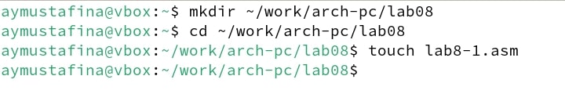
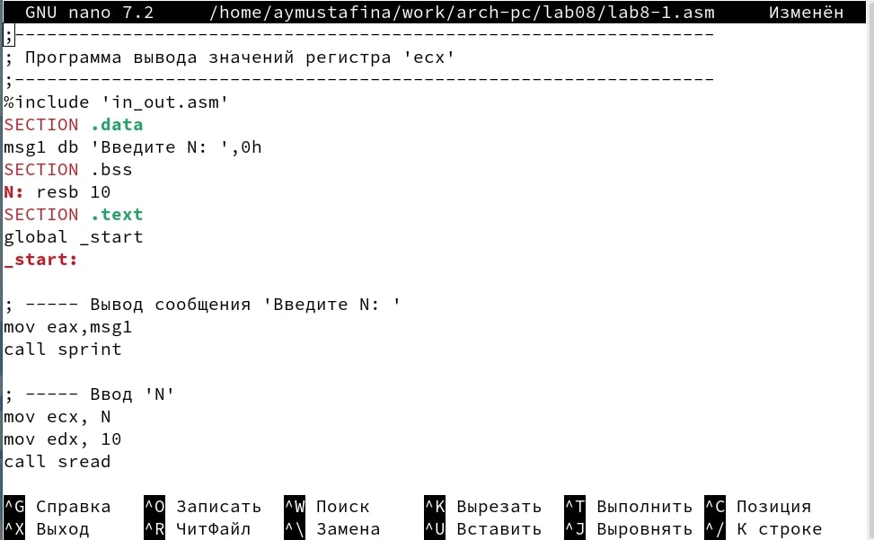
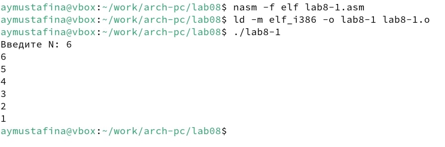
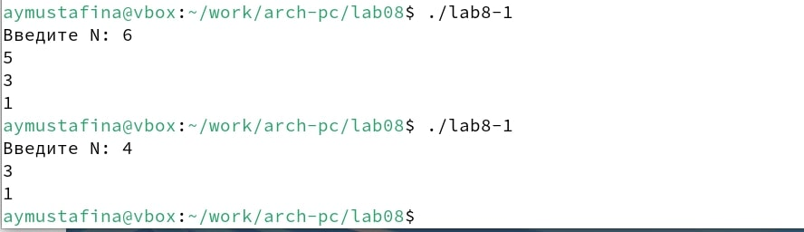
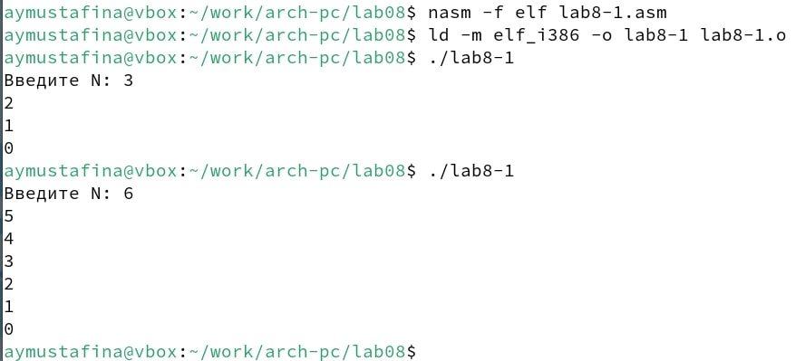
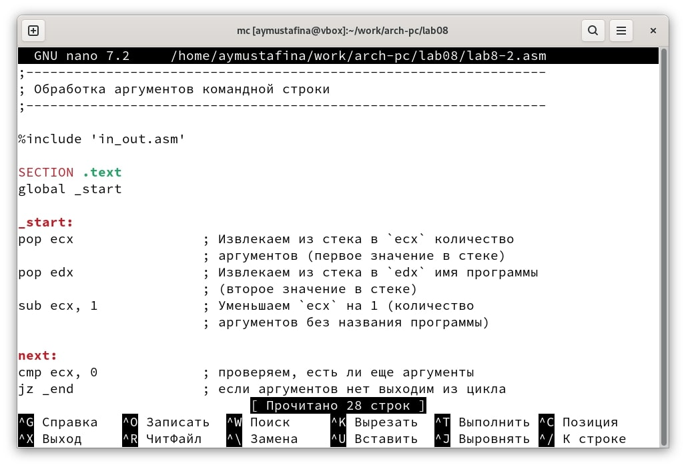
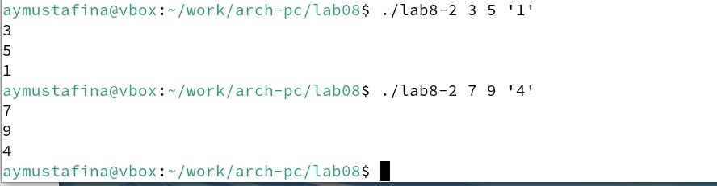
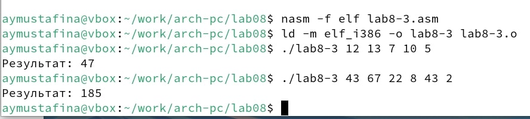
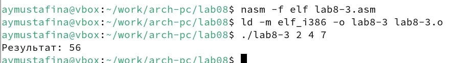
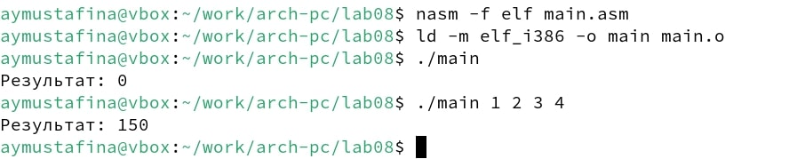

---
## Front matter
title: "Отчет по лабораторной работе №8"
subtitle: "Дисциплина: Архитектура компьютера"
author: "Мустафина Аделя Юрисовна"

## Generic otions
lang: ru-RU
toc-title: "Содержание"

## Bibliography
bibliography: bib/cite.bib
csl: pandoc/csl/gost-r-7-0-5-2008-numeric.csl

## Pdf output format
toc: true # Table of contents
toc-depth: 2
lof: true # List of figures
lot: true # List of tables
fontsize: 12pt
linestretch: 1.5
papersize: a4
documentclass: scrreprt
## I18n polyglossia
polyglossia-lang:
  name: russian
  options:
	- spelling=modern
	- babelshorthands=true
polyglossia-otherlangs:
  name: english
## I18n babel
babel-lang: russian
babel-otherlangs: english
## Fonts
mainfont: IBM Plex Serif
romanfont: IBM Plex Serif
sansfont: IBM Plex Sans
monofont: IBM Plex Mono
mathfont: STIX Two Math
mainfontoptions: Ligatures=Common,Ligatures=TeX,Scale=0.94
romanfontoptions: Ligatures=Common,Ligatures=TeX,Scale=0.94
sansfontoptions: Ligatures=Common,Ligatures=TeX,Scale=MatchLowercase,Scale=0.94
monofontoptions: Scale=MatchLowercase,Scale=0.94,FakeStretch=0.9
mathfontoptions:
## Biblatex
biblatex: true
biblio-style: "gost-numeric"
biblatexoptions:
  - parentracker=true
  - backend=biber
  - hyperref=auto
  - language=auto
  - autolang=other*
  - citestyle=gost-numeric
## Pandoc-crossref LaTeX customization
figureTitle: "Рис."
tableTitle: "Таблица"
listingTitle: "Листинг"
lofTitle: "Список иллюстраций"
lotTitle: "Список таблиц"
lolTitle: "Листинги"
## Misc options
indent: true
header-includes:
  - \usepackage{indentfirst}
  - \usepackage{float} # keep figures where there are in the text
  - \floatplacement{figure}{H} # keep figures where there are in the text
---

# Цель работы

Приобретение навыков написания программ с использованием циклов и обработкой
аргументов командной строки.

# Задание

 1. Порядок выполнения лабораторной работы.
 2. Выполнение заданий для самостоятельной работы

# Теоретическое введение

## 8.2.1. Организация стека

Стек — это структура данных, организованная по принципу LIFO («Last In — First Out»
или «последним пришёл — первым ушёл»). Стек является частью архитектуры процессора и
реализован на аппаратном уровне. Для работы со стеком в процессоре есть специальные
регистры (ss, bp, sp) и команды.

Основной функцией стека является функция сохранения адресов возврата и передачи
аргументов при вызове процедур. Кроме того, в нём выделяется память для локальных
переменных и могут временно храниться значения регистров.

Стек имеет вершину, адрес последнего добавленного элемента, который хранится в ре-
гистре esp (указатель стека). Противоположный конец стека называется дном. Значение,
помещённое в стек последним, извлекается первым. При помещении значения в стек указа-
тель стека уменьшается, а при извлечении — увеличивается.

Для стека существует две основные операции:
• добавление элемента в вершину стека (push);
• извлечение элемента из вершины стека (pop).

## 8.2.1.1. Добавление элемента в стек.

Команда push размещает значение в стеке, т.е. помещает значение в ячейку памяти, на
которую указывает регистр esp, после этого значение регистра esp увеличивается на 4.
Данная команда имеет один операнд — значение, которое необходимо поместить в стек.
Примеры:
```
push -10 ; Поместить -10 в стек
push ebx ; Поместить значение регистра ebx в стек
push [buf] ; Поместить значение переменной buf в стек
push word [ax] ; Поместить в стек слово по адресу в ax
```

Существует ещё две команды для добавления значений в стек. Это команда pusha, которая
помещает в стек содержимое всех регистров общего назначения в следующем порядке: ах,
сх, dx, bх, sp, bp, si, di. А также команда pushf, которая служит для перемещения в стек
содержимого регистра флагов. Обе эти команды не имеют операндов.

## 8.2.1.2. Извлечение элемента из стека.

Команда pop извлекает значение из стека, т.е. извлекает значение из ячейки памяти, на
которую указывает регистр esp, после этого уменьшает значение регистра esp на 4. У этой
команды также один операнд, который может быть регистром или переменной в памяти.
Нужно помнить, что извлечённый из стека элемент не стирается из памяти и остаётся как
“мусор”, который будет перезаписан при записи нового значения в стек.

Примеры:
```
pop eax ; Поместить значение из стека в регистр eax
pop [buf] ; Поместить значение из стека в buf
pop word[si] ; Поместить значение из стека в слово по адресу в si
```

Аналогично команде записи в стек существует команда popa, которая восстанавливает
из стека все регистры общего назначения, и команда popf для перемещения значений из
вершины стека в регистр флагов.

##8.2.2. Инструкции организации циклов

Для организации циклов существуют специальные инструкции. Для всех инструкций
максимальное количество проходов задаётся в регистре ecx. Наиболее простой является ин-
струкция loop. Она позволяет организовать безусловный цикл, типичная структура которого
имеет следующий вид:

```
mov ecx, 100 ; Количество проходов
NextStep:
...
... ; тело цикла
...
loop NextStep ; Повторить `ecx` раз от метки NextStep
```

Иструкция loop выполняется в два этапа. Сначала из регистра ecx вычитается единица и
его значение сравнивается с нулём. Если регистр не равен нулю, то выполняется переход к
указанной метке. Иначе переход не выполняется и управление передаётся команде, которая
следует сразу после команды loop.
         
# Выполнение лабораторной работы

## 8.3.1. Реализация циклов в NASM

Создаю каталог для программам лабораторной работы № 8, перехожу в него и создаю 
файл lab8-1.asm (рис. [-@fig:001]).

{#fig:001 width=70%}

Ввожу в файл текст программы из листинга 8.1. Создаю исполняемый файл и проверяю его 
работу (рис. [-@fig:002]).

{#fig:002 width=70%}

```
;Листинг 8.1 Программа вывода значений регистра ecx
;-----------------------------------------------------------------
; Программа вывода значений регистра 'ecx'
;-----------------------------------------------------------------
%include 'in_out.asm'

SECTION .data
msg1 db 'Введите N: ',0h

SECTION .bss
N: resb 10

SECTION .text
global _start

_start:
           ; ----- Вывод сообщения 'Введите N: '
mov eax,msg1
call sprint
           ; ----- Ввод 'N'
mov ecx, N
mov edx, 10
call sread
           ; ----- Преобразование 'N' из символа в число
mov eax,N
call atoi
mov [N],eax
           ; ------ Организация цикла
mov ecx,[N] ; Счетчик цикла, `ecx=N`

label:
mov [N],ecx
mov eax,[N]
call iprintLF   ; Вывод значения `N`
loop label      ; `ecx=ecx-1` и если `ecx` не '0'
                ; переход на `label`
call quit
```

Данный пример показывает, что использование регистра ecx в теле цилка loop может
привести к некорректной работе программы (рис. [-@fig:003]).

{#fig:003 width=70%}

Меняю текст программы, добавив изменение значения регистра ecx. Теперь выводятся 
значения от 1 до n с шагом 1 (рис. [-@fig:004]).

{#fig:004 width=70%}

```
;Изменение листинга 8.1, добавление изменения значения регистра ecx

label:
sub ecx,1 ; `ecx=ecx-1`
mov [N],ecx
mov eax,[N]
call iprintLF
loop label
```

Снова меняю текст программы, добавив команды push и pop 
(добавления в стек и извлечения из стека) для сохранения значения счетчика цикла loop.
Теперь выводит числа от 0 до n (рис. [-@fig:005]).

{#fig:005 width=70%}

```
;Изменение листинга 8.1, добавление команды push и pop
label:
push ecx ; добавление значения ecx в стек
sub ecx,1
mov [N],ecx
mov eax,[N]
call iprintLF
pop ecx ; извлечение значения ecx из стека
loop label
```
## 8.3.2. Обработка аргументов командной строки

При разработке программ иногда встает необходимость указывать аргументы, которые
будут использоваться в программе, непосредственно из командной строки при запуске
программы.
При запуске программы в NASM аргументы командной строки загружаются в стек в обрат-
ном порядке, кроме того в стек записывается имя программы и общее количество аргументов.
Последние два элемента стека для программы, скомпилированной NASM, – это всегда имя
программы и количество переданных аргументов.
Таким образом, для того чтобы использовать аргументы в программе, их просто нужно
извлечь из стека. Обработку аргументов нужно проводить в цикле. Т.е. сначала нужно из-
влечь из стека количество аргументов, а затем циклично для каждого аргумента выполнить
логику программы. 

```
;Листинг 8.2. Программа выводящая на экран аргументы командной строки
;-----------------------------------------------------------------
; Обработка аргументов командной строки
;-----------------------------------------------------------------

%include 'in_out.asm'

SECTION .text
global _start

_start:
pop ecx                ; Извлекаем из стека в `ecx` количество
                       ; аргументов (первое значение в стеке)
pop edx                ; Извлекаем из стека в `edx` имя программы
                       ; (второе значение в стеке)
sub ecx, 1             ; Уменьшаем `ecx` на 1 (количество
                       ; аргументов без названия программы)

next:
cmp ecx, 0             ; проверяем, есть ли еще аргументы
jz _end                ; если аргументов нет выходим из цикла
                       ; (переход на метку `_end`)
pop eax                ; иначе извлекаем аргумент из стека
call sprintLF          ; вызываем функцию печати
loop next              ; переход к обработке следующего
                       ; аргумента (переход на метку `next`)

_end:
call quit
```

Создаю файл и ввожу в него текст программы из листинга 8.2 (рис. [-@fig:006]).

{#fig:006 width=70%}

Запускаю файл, указав аргументы. Все аргументы были обработаны программой (рис. [-@fig:007]).

{#fig:007 width=70%}

Рассмотрим программу, которая выводит сумму чисел, которые были преданы в программу как 
аргументы (рис. [-@fig:008]).

{#fig:008 width=70%}

```
;Листинг 8.3. Программа вычисления суммы аргументов командной строки

%include 'in_out.asm'

SECTION .data
msg db "Результат: ",0

SECTION .text
global _start

_start:
pop ecx                  ; Извлекаем из стека в `ecx` количество
                         ; аргументов (первое значение в стеке)
pop edx                  ; Извлекаем из стека в `edx` имя программы
                         ; (второе значение в стеке)
sub ecx,1                ; Уменьшаем `ecx` на 1 (количество
                         ; аргументов без названия программы)
mov esi, 0            ; Используем `esi` для хранения
                         ; промежуточных сумм

next:
cmp ecx,0h               ; проверяем, есть ли еще аргументы
jz _end                  ; если аргументов нет выходим из цикла
                         ; (переход на метку `_end`)
pop eax                  ; иначе извлекаем следующий аргумент из стека
call atoi                ; преобразуем символ в число
add esi, eax              ; добавляем к промежуточной сумме
                         ; след. аргумент `esi=esi*eax`
loop next                ; переход к обработке следующего аргумента

_end:
mov eax, msg             ; вывод сообщения "Результат: "
call sprint
mov eax, esi             ; записываем сумму в регистр `eax`
call iprintLF            ; печать результата
call quit                ; завершение программы
```

Меняю программу листинга 8.3 для вычисления произведения аргументов командной 
строки(рис. [-@fig:009]).

{#fig:009 width=70%}

```
;Листинг 8.3. Программа вычисления произведения аргументов командной строки

%include 'in_out.asm'

SECTION .data
msg db "Результат: ",0

SECTION .text
global _start

_start:
pop ecx                  ; Извлекаем из стека в `ecx` количество
                         ; аргументов (первое значение в стеке)
pop edx                  ; Извлекаем из стека в `edx` имя программы
                         ; (второе значение в стеке)
sub ecx,1                ; Уменьшаем `ecx` на 1 (количество
                         ; аргументов без названия программы)
mov esi, 1               ; Используем `esi` для хранения
                         ; промежуточных сумм

next:
cmp ecx,0h               ; проверяем, есть ли еще аргументы
jz _end                  ; если аргументов нет выходим из цикла
                         ; (переход на метку `_end`)
pop eax                  ; иначе извлекаем следующий аргумент из стека
call atoi                ; преобразуем символ в число
imul esi, eax              ; добавляем к промежуточной сумме
                         ; след. аргумент `esi=esi*eax`
loop next                ; переход к обработке следующего аргумента

_end:
mov eax, msg             ; вывод сообщения "Результат: "
call sprint
mov eax, esi             ; записываем сумму в регистр `eax`
call iprintLF            ; печать результата
call quit                ; завершение программы
```

# 8.4. Задание для самостоятельной работы

Напишу программу, которая находит сумму значений функции f(x) для
x = x1, x2, ..., xn, т.е. программа должна выводить значение f(x1) + f(x2) + ... + f(xn).
Значения xi передаются как аргументы. Вид функции для моего 20 варианта f(x) = 3*(10 + x).
Проверяю работу файла main (рис. [-@fig:010]).

{#fig:010 width=70%}

```
;----------Задание для самостоятельной работы-------------------

%include 'in_out.asm'

SECTION .data
msg db "Результат: ",0

SECTION .text
global _start

_start:
pop ecx
pop edx
sub ecx,1
mov esi, 0

next:
cmp ecx,0h ; проверка количества аргуметов
jz _end;если больше нт аргуметов переходи к энду

pop eax ;
call atoi ; из строки в число
add eax, 10 ; Прибавляем 10
imul eax, eax, 3 ; Умножаем на 3
add esi, eax ; Суммируем значения
loop next ; Переходим к другому аргументу

_end:
mov eax, msg ;  "Результат: "
call sprint
mov eax, esi ; Замисываем полученное значение
call iprintLF
call quit
```

# Выводы

В ходе выполнения лабораторной работы я научилась работать с циклами на языке ассемблер.

# Список литературы

1. [Лабораторная работа №8](https://esystem.rudn.ru/pluginfile.php/2089095/mod_resource/content/0/%D0%9B%D0%B0%D0%B1%D0%BE%D1%80%D0%B0%D1%82%D0%BE%D1%80%D0%BD%D0%B0%D1%8F%20%D1%80%D0%B0%D0%B1%D0%BE%D1%82%D0%B0%20%E2%84%968.%20%D0%9F%D1%80%D0%BE%D0%B3%D1%80%D0%B0%D0%BC%D0%BC%D0%B8%D1%80%D0%BE%D0%B2%D0%B0%D0%BD%D0%B8%D0%B5%20%D1%86%D0%B8%D0%BA%D0%BB%D0%B0.%20%D0%9E%D0%B1%D1%80%D0%B0%D0%B1%D0%BE%D1%82%D0%BA%D0%B0%20%D0%B0%D1%80%D0%B3%D1%83%D0%BC%D0%B5%D0%BD%D1%82%D0%BE%D0%B2%20%D0%BA%D0%BE%D0%BC%D0%B0%D0%BD%D0%B4%D0%BD%D0%BE%D0%B9%20%D1%81%D1%82%D1%80%D0%BE%D0%BA%D0%B8..pdf)

