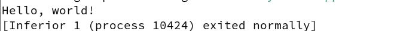

---
## Front matter
title: "Отчет по лабораторной работе №9"
subtitle: "Дисциплина: Архитектура компьютера"
author: "Мустафина Аделя Юрисовна"

## Generic otions
lang: ru-RU
toc-title: "Содержание"

## Bibliography
bibliography: bib/cite.bib
csl: pandoc/csl/gost-r-7-0-5-2008-numeric.csl

## Pdf output format
toc: true # Table of contents
toc-depth: 2
lof: true # List of figures
lot: true # List of tables
fontsize: 12pt
linestretch: 1.5
papersize: a4
documentclass: scrreprt
## I18n polyglossia
polyglossia-lang:
  name: russian
  options:
	- spelling=modern
	- babelshorthands=true
polyglossia-otherlangs:
  name: english
## I18n babel
babel-lang: russian
babel-otherlangs: english
## Fonts
mainfont: IBM Plex Serif
romanfont: IBM Plex Serif
sansfont: IBM Plex Sans
monofont: IBM Plex Mono
mathfont: STIX Two Math
mainfontoptions: Ligatures=Common,Ligatures=TeX,Scale=0.94
romanfontoptions: Ligatures=Common,Ligatures=TeX,Scale=0.94
sansfontoptions: Ligatures=Common,Ligatures=TeX,Scale=MatchLowercase,Scale=0.94
monofontoptions: Scale=MatchLowercase,Scale=0.94,FakeStretch=0.9
mathfontoptions:
## Biblatex
biblatex: true
biblio-style: "gost-numeric"
biblatexoptions:
  - parentracker=true
  - backend=biber
  - hyperref=auto
  - language=auto
  - autolang=other*
  - citestyle=gost-numeric
## Pandoc-crossref LaTeX customization
figureTitle: "Рис."
tableTitle: "Таблица"
listingTitle: "Листинг"
lofTitle: "Список иллюстраций"
lotTitle: "Список таблиц"
lolTitle: "Листинги"
## Misc options
indent: true
header-includes:
  - \usepackage{indentfirst}
  - \usepackage{float} # keep figures where there are in the text
  - \floatplacement{figure}{H} # keep figures where there are in the text
---

# Цель работы

Приобретение навыков написания программ с использованием подпрограмм. Знакомство
с методами отладки при помощи GDB и его основными возможностями.

# Задание

1. Порядок выполнения лабораторной работы.
2. Выполнение заданий для самостоятельной работы


# Теоретическое введение
## 9.2.1. Понятие об отладке

Отладка — это процесс поиска и исправления ошибок в программе. В общем случае его
можно разделить на четыре этапа:

- обнаружение ошибки;
- поиск её местонахождения;
- определение причины ошибки;
- исправление ошибки.
Можно выделить следующие типы ошибок:
- синтаксические ошибки — обнаруживаются во время трансляции исходного кода и
вызваны нарушением ожидаемой формы или структуры языка;
- семантические ошибки — являются логическими и приводят к тому, что программа
запускается, отрабатывает, но не даёт желаемого результата;
- ошибки в процессе выполнения — не обнаруживаются при трансляции и вызывают пре-
рывание выполнения программы (например, это ошибки, связанные с переполнением
или делением на ноль).

Второй этап — поиск местонахождения ошибки. Некоторые ошибки обнаружить доволь-
но трудно. Лучший способ найти место в программе, где находится ошибка, это разбить
программу на части и произвести их отладку отдельно друг от друга.

Третий этап — выяснение причины ошибки. После определения местонахождения ошибки
обычно проще определить причину неправильной работы программы.

Последний этап — исправление ошибки. После этого при повторном запуске программы,
может обнаружиться следующая ошибка, и процесс отладки начнётся заново.

## 9.2.2. Методы отладки

Наиболее часто применяют следующие методы отладки:

- создание точек контроля значений на входе и выходе участка программы (например,
вывод промежуточных значений на экран — так называемые диагностические сообще-
ния);
- использование специальных программ-отладчиков.

Отладчики позволяют управлять ходом выполнения программы, контролировать и из-
менять данные. Это помогает быстрее найти место ошибки в программе и ускорить её
исправление. Наиболее популярные способы работы с отладчиком — это использование
точек останова и выполнение программы по шагам.

Пошаговое выполнение — это выполнение программы с остановкой после каждой строчки,
чтобы программист мог проверить значения переменных и выполнить другие действия.
Точки останова — это специально отмеченные места в программе, в которых программа-
отладчик приостанавливает выполнение программы и ждёт команд. Наиболее популярные
виды точек останова:

- Breakpoint — точка останова (остановка происходит, когда выполнение доходит до
определённой строки, адреса или процедуры, отмеченной программистом);
- Watchpoint — точка просмотра (выполнение программы приостанавливается, если
программа обратилась к определённой переменной: либо считала её значение, либо
изменила его).

Точки останова устанавливаются в отладчике на время сеанса работы с кодом програм-
мы, т.е. они сохраняются до выхода из программы-отладчика или до смены отлаживаемой
программы.

## 9.3. Основные возможности отладчика GDB

GDB (GNU Debugger — отладчик проекта GNU) [1] работает на многих UNIX-подобных
системах и умеет производить отладку многих языков программирования. GDB предлагает
обширные средства для слежения и контроля за выполнением компьютерных программ. От-
ладчик не содержит собственного графического пользовательского интерфейса и использует
стандартный текстовый интерфейс консоли. Однако для GDB существует несколько сторон-
них графических надстроек, а кроме того, некоторые интегрированные среды разработки
используют его в качестве базовой подсистемы отладки.
Отладчик GDB (как и любой другой отладчик) позволяет увидеть, что происходит «внутри»
программы в момент её выполнения или что делает программа в момент сбоя.

GDB может выполнять следующие действия:

- начать выполнение программы, задав всё, что может повлиять на её поведение;
- остановить программу при указанных условиях;
- исследовать, что случилось, когда программа остановилась;
- изменить программу так, чтобы можно было поэкспериментировать с устранением
эффектов одной ошибки и продолжить выявление других.

## 9.3.1. Запуск отладчика GDB; выполнение программы; выход

Синтаксис команды для запуска отладчика имеет следующий вид:
```
gdb [опции] [имя_файла | ID процесса]
```
После запуска gdb выводит текстовое сообщение — так называемое «nice GDB logo». В
следующей строке появляется приглашение (gdb) для ввода команд.
Далее приведён список некоторых команд GDB.
Команда run (сокращённо r) — запускает отлаживаемую программу в оболочке GDB.
Если точки останова не были установлены, то программа выполняется и выводятся сооб-
щения:
```
(gdb) run
Starting program: test
Program exited normally.
(gdb)
```
Если точки останова были заданы, то отладчик останавливается на соответствующей
команде и выдаёт номер точки останова, адрес и дополнительную информацию — текущую
строку, имя процедуры, и др.

Команда kill (сокращённо k) прекращает отладку программы, после чего следует вопрос
о прекращении процесса отладки:
```
Kill the program being debugged? (y or n) y
```
Если в ответ введено y (то есть «да»), отладка программы прекращается. Командой
run её можно начать заново, при этом все точки останова (breakpoints), точки просмотра
(watchpoints) и точки отлова (catchpoints) сохраняются.
Для выхода из отладчика используется команда quit (или сокращённо q):
```
(gdb) q
```
## 9.3.2. Дизассемблирование программы

Если есть файл с исходным текстом программы, а в исполняемый файл включена информа-
ция о номерах строк исходного кода, то программу можно отлаживать, работая в отладчике
непосредственно с её исходным текстом. Чтобы программу можно было отлаживать на
уровне строк исходного кода, она должна быть откомпилирована с ключом -g.
Посмотреть дизассемблированный код программы можно с помощью команды
```
disassemble <метка/адрес>:
(gdb) disassemble _start
```

Существует два режима отображения синтаксиса машинных команд: режим Intel, ис-
пользуемый в том числе в NASM, и режим ATT (значительно отличающийся внешне). По
умолчанию в дизассемблере GDB принят режим ATT. Переключиться на отображение команд
с привычным Intel’овским синтаксисом можно, введя команду set disassembly-flavor
intel

## 9.3.3. Точки останова

Установить точку останова можно командой break (кратко b). Типичный аргумент этой
команды — место установки. Его можно задать как имя метки или как адрес. Чтобы не было
путаницы с номерами, перед адресом ставится «звёздочка»:
```
(gdb) break *<адрес>
(gdb) b <метка>
```
Информацию о всех установленных точках останова можно вывести командой info (крат-
ко i):
```
(gdb) info breakpoints
(gdb) i b
```
Для того чтобы сделать неактивной какую-нибудь ненужную точку останова, можно вос-
пользоваться командой disable:
```
disable breakpoint <номер точки останова>
```
Обратно точка останова активируется командой enable:
```
enable breakpoint <номер точки останова>
```
Если же точка останова в дальнейшем больше не нужна, она может быть удалена с помощью
команды delete:
```
(gdb) delete breakpoint <номер точки останова>
```
Ввод этой команды без аргумента удалит все точки останова.
Информацию о командах этого раздела можно получить, введя
```
help breakpoints
```

## 9.3.4. Пошаговая отладка

Для продолжения остановленной программы используется команда:
```
continue (c) (gdb)
с [аргумент] 
```
Выполнение программы будет происходить до следующей точки останова.
В качестве аргумента может использоваться целое число N, которое указывает отладчику
проигнорировать N - 1 точку останова (выполнение остановится на N-й точке).
Команда ```stepi (кратко sI)``` позволяет выполнять программу по шагам, т.е. данная команда
выполняет ровно одну инструкцию:
```
(gdb) si [аргумент]
```
При указании в качестве аргумента целого числа N отладчик выполнит команду step N
раз при условии, что не будет точек останова или выполнение программы не прервётся по
другим причинам.
Команда ```nexti (или ni)``` аналогична stepi, но вызов процедуры (функции) трактуется
отладчиком как одна инструкция:
```
(gdb) ni [аргумент]
```
Информацию о командах этого раздела можно получить, введя
```
(gdb) help running
```
## 9.3.5. Работа с данными программы в GDB

Как уже упоминалось, отладчик может показывать содержимое ячеек памяти и регистров,
а при необходимости позволяет вручную изменять значения регистров и переменных.
Посмотреть содержимое регистров можно с помощью команды info registers (или ir):
```
(gdb) info registers
```
Для отображения содержимого памяти можно использовать команду x/NFU <адрес>, выдаёт 
содержимое ячейки памяти по указанному адресу. NFU задает формат, в котором выводятся
данных.
Например, x/4uh 0x63450 — это запрос на вывод четырёх полуслов (h) из памяти в формате
беззнаковых десятичных целых (u), начиная с адреса 0x63450.
Чтобы посмотреть значения регистров используется команда print /F <val> (сокращен-
но p). Перед именем регистра обязательно ставится префикс $. Например, команда p/x $ecx
выводит значение регистра в шестнадцатеричном формате.
Изменить значение для регистра или ячейки памяти можно с помощью команды set,
задав ей в качестве аргумента имя регистра или адрес. При этом перед именем регистра
ставится префикс $, а перед адресом нужно указать в фигурных скобках тип данных (размер
сохраняемого значения; в качестве типа данных можно использовать типы языка Си).
Справку о любой команде gdb можно получить, введя
```
(gdb) help [имя_команды]
```

## 9.3.6. Понятие подпрограммы
 
Подпрограмма — это, как правило, функционально законченный участок кода, который
можно многократно вызывать из разных мест программы. В отличие от простых переходов
из подпрограмм существует возврат на команду, следующую за вызовом.
Если в программе встречается одинаковый участок кода, его можно оформить в виде
подпрограммы, а во всех нужных местах поставить её вызов. При этом подпрограмма бу-
дет содержаться в коде в одном экземпляре, что позволит уменьшить размер кода всей
программы.

### 9.3.6.1. Инструкция call и инструкция ret
 
Для вызова подпрограммы из основной программы используется инструкция call, кото-
рая заносит адрес следующей инструкции в стек и загружает в регистр eip адрес соответству-
ющей подпрограммы, осуществляя таким образом переход. Затем начинается выполнение
подпрограммы, которая, в свою очередь, также может содержать подпрограммы.
Подпрограмма завершается инструкцией ret, которая извлекает из стека адрес, занесён-
ный туда соответствующей инструкцией call, и заносит его в eip. После этого выполнение
основной программы возобновится с инструкции, следующей за инструкцией call.
Подпрограмма может вызываться как из внешнего файла, так и быть частью основной
программы.

Важно помнить, что если в подпрограмме занести что-то в стек и не извлечь, то на вершине
стека окажется не адрес возврата и это приведёт к ошибке выхода из подпрограммы. Кроме
того, надо помнить, что подпрограмма без команды возврата не вернётся в точку вызова, а
будет выполнять следующий за подпрограммой код, как будто он является её продолжением.

# 9.4 Выполнение лабораторной работы
## 9.4.1. Реализация подпрограмм в NASM

Создаю каталог для выполнения лабораторной работы №9, и создаю файл lab09-1.asm (рис. [-@fig:001]).

{#fig:001 width=70%}

В качестве примера рассмотрим программу вычисления арифметического выражения
f(x) = 2*x + 7 с помощью подпрограммы _calcul. В данном примере x вводится с
клавиатуры, а само выражение вычисляется в подпрограмме. Внимательно изучите
текст программы (Листинг 9.1).

*Листинг 9.1. Пример программы с использованием вызова подпрограммы*

```
%include 'in_out.asm'

SECTION .data
msg: DB 'Введите x: ',0
result: DB '2x+7=',0

SECTION .bss
x: RESB 80
res: RESB 80

SECTION .text
GLOBAL _start

_start:
;------------------------------------------
; Основная программа
;------------------------------------------
mov eax, msg
call sprint

mov ecx, x
mov edx, 80
call sread

mov eax,x
call atoi

call _calcul ; Вызов подпрограммы _calcul

mov eax,result
call sprint
mov eax,[res]
call iprintLF

call quit

;------------------------------------------
; Подпрограмма вычисления
; выражения "2x+7"

_calcul:
mov ebx,2
mul ebx
add eax,7
mov [res],eax
ret ; выход из подпрограммы
```

Первые строки программы отвечают за вывод сообщения на экран (call sprint), чтение
данных введенных с клавиатуры (call sread) и преобразования введенных данных из
символьного вида в численный (call atoi).

```
mov eax, msg            ; вызов подпрограммы печати сообщения
call sprint             ; 'Введите x: '

mov ecx, x
mov edx, 80
call sread              ; вызов подпрограммы ввода сообщения

mov eax,x               ; вызов подпрограммы преобразования
call atoi               ; ASCII кода в число, `eax=x`
```
После следующей инструкции call _calcul, которая передает управление подпрограмме
_calcul, будут выполнены инструкции подпрограммы:
```
mov ebx,2
mul ebx
add eax,7
mov [res],eax
ret
```

Инструкция ret является последней в подпрограмме и ее исполнение приводит к воз-
вращению в основную программу к инструкции, следующей за инструкцией call, которая
вызвала данную подпрограмму.
Последние строки программы реализую вывод сообщения (call sprint), результата вы-
числения (call iprintLF) и завершение программы (call quit).

Ввела в файл lab09-1.asm текст программы из листинга 9.1. Создала исполняемый
файл и проверила его работу (рис. [-@fig:002]).

{#fig:002 width=70%}

Изменила текст программы, добавив подпрограмму _subcalcul в подпрограмму _calcul,
для вычисления выражения f(g(x)), где x вводится с клавиатуры, f(x) = 2*x +7, g(x) = 3*x - 1.
Т.е. x передается в подпрограмму _calcul из нее в подпрограмму _subcalcul, где
вычисляется выражение g(x), результат возвращается в _calcul и вычисляется выражение
f(g(x)). Результат возвращается в основную программу для вывода результата на экран (рис. [-@fig:003]).

{#fig:003 width=70%}

*Листинг 9.1. Вычисление выражения f(g(x))*

```
%include 'in_out.asm'

SECTION .data
msg: DB 'Введите x: ',0
result: DB 'f(g(x)) = ',0

SECTION .bss
x: RESB 80
res: RESB 80

SECTION .text
GLOBAL _start

_start:
;------------------------------------------
; Основная программа
;------------------------------------------
    mov eax, msg
    call sprint              ; 'Введите x: '
    
    mov ecx, x
    mov edx, 80
    call sread              ; Ввод x с клавиатуры
    
    mov eax, x
    call atoi               ; Преобразование ASCII кода в число, eax=x
    
    call _calcul            ; Вызов подпрограммы _calcul
    
    mov eax, result
    call sprint             ; 'f(g(x)) = '
    
    mov eax, [res]         ; Получаем результат из памяти
    call iprintLF          ; Выводим результат
    
    call quit              ; Завершение программы

;------------------------------------------
; Подпрограмма вычисления выражения "f(g(x))"
; f(x) = 2x + 7, g(x) = 3x - 1
;------------------------------------------
_calcul:
    push eax                ; Сохраняем x на стеке
    call _subcalcul         ; Вызываем подпрограмму _subcalcul
    pop ebx                 ; Восстанавливаем x из стека (если нужно)

    ; Теперь eax содержит g(x), вычисляем f(g(x))
    mov ebx, 2
    mul eax                 ; Умножаем g(x) на 2
    add eax, 7              ; Добавляем 7
    mov [res], eax          ; Сохраняем результат в res
    ret                     ; Возврат в основную программу

;------------------------------------------
; Подпрограмма вычисления g(x)
; g(x) = 3x - 1
;------------------------------------------
_subcalcul:
    push eax                ; Сохраняем x на стеке
    mov ebx, 3
    mul ebx                 ; Умножаем x на 3
    sub eax, 1              ; Вычисляем g(x) = 3x - 1
    pop ebx                 ; Восстанавливаем x (если нужно)
    ret                     ; Возврат в _calcul

```


## 9.4.2. Отладка программам с помощью GDB

Создаю файл lab09-2.asm с текстом программы из Листинга 9.2. (Программа печати
сообщения Hello world!):

*Листинг 9.2. Программа вывода сообщения Hello world*

```
SECTION .data
msg1: db "Hello, ",0x0
msg1Len: equ $ - msg1
msg2: db "world!",0xa
msg2Len: equ $ - msg2

SECTION .text
global _start

_start:
mov eax, 4
mov ebx, 1
mov ecx, msg1
mov edx, msg1Len
int 0x80

mov eax, 4
mov ebx, 1
mov ecx, msg2
mov edx, msg2Len
int 0x80

mov eax, 1
mov ebx, 0
int 0x80
```

Провожу трансляцию файла с ключом '-g’. Так как для работы с GDB в исполняемый файл 
необходимо добавить отладочную информацию (рис. [-@fig:004]).

{#fig:004 width=70%}


```
nasm -f elf -g -l lab09-2.lst lab09-2.asm
ld -m elf_i386 -o lab09-2 lab09-2.o
```
 
Загружаю исполняемый файл в отладчик gdb: `gdb lab09-2` (рис. [-@fig:005]).

{#fig:005 width=70%}

Проверяю работу программы, запустив ее в оболочке GDB с помощью команды run (сокращённо r) (рис. [-@fig:006]).

{#fig:006 width=70%}

```
(gdb) run
Starting program: ~/work/arch-pc/lab09/lab09-2
Hello, world!
[Inferior 1 (process 10220) exited normally]
(gdb)
```


Для более подробного анализа программы устанавливаю брейкпоинт на метку _start, с
которой начинается выполнение любой ассемблерной программы, и запускаю её(рис. [-@fig:007]).

{#fig:007 width=70%}

```
(gdb) break _start
Breakpoint 1 at 0x8049000: file lab09-2.asm, line 12.
(gdb) run
Starting program: ~/work/arch-pc/lab09/lab09-2
Breakpoint 1, _start () at lab09-2.asm:12
12 mov eax, 4
```

Изучаю дисассимилированный код программы с помощью команды disassemble
начиная с метки _start (рис. [-@fig:008]).

{#fig:008 width=70%}

```
(gdb) disassemble _start
```


Переключаюсь на отображение команд с Intel’овским синтаксисом, введя команду set
disassembly-flavor intel(рис. [-@fig:009]).

{#fig:009 width=70%}

```
(gdb) set disassembly-flavor intel
(gdb) disassemble _start
```

Различия отображения синтаксиса машинных команд в режимах ATT и Intel. В режиме ATT регистры
пишутся с "%" и они расположены после указания их размера.
Включаю режим псевдографики для более удобного анализа программы (рис. [-@fig:010]).

{#fig:010 width=70%}

(рис. [-@fig:011])
   
{#fig:011 width=70%}

```
(gdb) layout asm
(gdb) layout regs
```

В этом режиме есть три окна:
• В верхней части видны названия регистров и их текущие значения;
• В средней части виден результат дисассимилирования программы;
• Нижняя часть доступна для ввода команд.

Однако, к сожалению, у меня не отображаются регистры.

### 9.4.2.1. Добавление точек останова

Установить точку останова можно командой break (кратко b). Типичный аргумент этой
команды — место установки. Его можно задать или как номер строки программы (имеет
смысл, если есть исходный файл, а программа компилировалась с информацией об отладке),
или как имя метки, или как адрес. Чтобы не было путаницы с номерами, перед адресом
ставится «звёздочка»:
На предыдущих шагах была установлена точка останова по имени метки (_start).Проверяю
это с помощью команды info breakpoints (кратко i b)(рис. [-@fig:012]).
   
{#fig:012 width=70%}
   
```
(gdb) info breakpoints
```
Установлю еще одну точку останова по адресу инструкции. Адрес инструкции можно
увидеть в средней части экрана в левом столбце соответствующей инструкции.
Определяю адрес предпоследней инструкции (mov ebx,0x0) и установляю точку останова
```
(gdb) break *<адрес>
```
Посмотриваю информацию о всех установленных точках останова (рис. [-@fig:013]).
   
{#fig:013 width=70%}
   
```
(gdb) i b
```

### 9.4.2.2. Работа с данными программы в GDB

Отладчик может показывать содержимое ячеек памяти и регистров, а при необходимости
позволяет вручную изменять значения регистров и переменных.

Пытаюсь вновь просмотреть содержимое регистров с помощью команды info registers
(или i r)(рис. [-@fig:014]).
   
{#fig:014 width=70%}
   
```
(gdb) info registers
```
Для отображения содержимого памяти можно использовать команду x <адрес>, которая
выдаёт содержимое ячейки памяти по указанному адресу. Формат, в котором выводятся
данные, можно задать после имени команды через косую черту: x/NFU <адрес>.
С помощью команды x &<имя переменной> также можно посмотреть содержимое пере-
менной.
Просмотрю значение переменной msg1 по имени (рис. [-@fig:015]).
   
{#fig:015 width=70%}
   
```
(gdb) x/1sb &msg1
0x804a000 <msg1>: "Hello, "
```

Посмотрю значение переменной msg2 по адресу. Адрес переменной можно определить
по дизассемблированной инструкции. Посмотрю инструкцию mov ecx,msg2 которая запи-
сывает в регистр ecx адрес перемененной msg2 (рис. [-@fig:016]).
   
{#fig:016 width=70%}

Изменить значение для регистра или ячейки памяти можно с помощью команды set,
задав ей в качестве аргумента имя регистра или адрес. При этом перед именем регистра
ставится префикс $, а перед адресом нужно указать в фигурных скобках тип данных (раз-
мер сохраняемого значения; в качестве типа данных можно использовать типы языка Си).
Меняю первый символ переменной msg1 (рис. [-@fig:017]).
   
{#fig:017 width=70%}
   
```
(gdb) set {char}msg1='h'
(gdb) x/1sb &msg1
0x804a000 <msg1>: "hello, "
(gdb)
```
Меняю символ во второй переменной msg2 (рис. [-@fig:018]).
   
{#fig:018 width=70%}
   
Чтобы посмотреть значения регистров используется команда print /F <val> (перед име-
нем регистра обязательно ставится префикс $)

```
p/F $<регистр>
```

С помощью команды set меняю значение регистра ebx. Вывод команд отличается, 
так как в первом случае мы записывали символ, а во втором случае уже само
число (рис. [-@fig:019]).
    
{#fig:019 width=70%}
    
```
(gdb) set $ebx='2'
(gdb) p/s $ebx
```

Завершаю выполнение программы с помощью команды continue (сокращенно c) или
stepi (сокращенно si) и выхожу из GDB с помощью команды quit (сокращенно q).

### 9.4.2.3. Обработка аргументов командной строки в GDB

Копирую файл lab8-2.asm, созданный при выполнении лабораторной работы №8,
с программой выводящей на экран аргументы командной строки (Листинг 8.2) в файл с
именем lab09-3.asm:
```
cp ~/work/arch-pc/lab08/lab8-2.asm ~/work/arch-pc/lab09/lab09-3.asm
```
Создаю исполняемый файл.
```
nasm -f elf -g -l lab09-3.lst lab09-3.asm
ld -m elf_i386 -o lab09-3 lab09-3.o
```
Для загрузки в gdb программы с аргументами необходимо использовать ключ --args.
Загружаю исполняемый файл в отладчик, указав аргументы:
```
gdb --args lab09-3 аргумент1 аргумент 2 'аргумент 3'
```
Как отмечалось в предыдущей лабораторной работе, при запуске программы аргументы
командной строки загружаются в стек. Исследую расположение аргументов командной
строки в стеке после запуска программы с помощью gdb (рис. [-@fig:020]).
    
{#fig:020 width=70%}
    
Для начала установливаю точку останова перед первой инструкцией в программе и 
запускаю ее (рис. [-@fig:021]).
    
{#fig:021 width=70%}

(рис. [-@fig:022]).
    
{#fig:022 width=70%}
    
```
(gdb) b _start
(gdb) run
```

Адрес вершины стека храниться в регистре esp и по этому адресу располагается число
равное количеству аргументов командной строки (включая имя программы)(рис. [-@fig:023]).
    
{#fig:023 width=70%}
    
```
(gdb) x/x $esp
0xffffd200: 0x05
```

Как видно, число аргументов равно 4 – это имя программы lab09-3 и непосредственно
аргументы: аргумент1, аргумент, 2 и 'аргумент 3'.

Просматриваю остальные позиции стека – по адесу [esp+4] располагается адрес в памяти
где находиться имя программы, по адесу [esp+8] храниться адрес первого аргумента, по
аресу [esp+12] – второго и т.д. (рис. [-@fig:024]).
    
{#fig:024 width=70%}
    
```
(gdb) x/s *(void**)($esp + 4)
0xffffd358: "~/lab09-3"
(gdb) x/s *(void**)($esp + 8)
0xffffd3bc: "аргумент1"
(gdb) x/s *(void**)($esp + 12)
0xffffd3ce: "аргумент"
(gdb) x/s *(void**)($esp + 16)
0xffffd3df: "2"
(gdb) x/s *(void**)($esp + 20)
0xffffd3e1: "аргумент 3"
(gdb) x/s *(void**)($esp + 24)
0x0: <error: Cannot access memory at address 0x0>
(gdb)
```
Шаг изменения адреса равен 4 ([esp+4], [esp+8], [esp+12] и т.д.).
Стек в x86 организован таким образом, что каждый элемент стека 
(например, адреса или указатели) занимает 4 байта. Когда вы обращаетесь к 
элементам стека, вы фактически работаете с указателями на данные, и каждый 
указатель занимает 4 байта.


## 9.5. Задание для самостоятельной работы

1. Преобразую программу из лабораторной работы №8 (Задание №1 для самостоятельной 
работы), реализовав вычисление значения функции f(x) как подпрограмму (рис. [-@fig:025]).
    
{#fig:025 width=70%}
    
* Листинг для задания 1 из самостоятельной работы *

```
;---------- Задание для самостоятельной работы -------------------

%include 'in_out.asm'

SECTION .data
msg db "Результат: ",0

SECTION .text
global _start

_start:
    pop ecx          ; Получаем количество аргументов
    pop edx          ; Получаем адрес первого аргумента
    sub ecx, 1      ; Уменьшаем на 1, так как первый аргумент - это имя программы
    mov esi, 0      ; Инициализируем сумму

next:
    cmp ecx, 0h     ; Проверка количества аргументов
    jz _end         ; Если нет аргументов, переходим к завершению

    pop eax         ; Получаем следующий аргумент
    call atoi       ; Преобразуем строку в число
    call f          ; Вызываем функцию f(x)
    add esi, eax    ; Суммируем значения
    loop next       ; Переходим к следующему аргументу

_end:
    mov eax, msg    ; Подготовка сообщения "Результат: "
    call sprint     ; Выводим сообщение
    mov eax, esi    ; Загружаем полученное значение
    call iprintLF   ; Выводим результат
    call quit       ; Завершение программы

; Подпрограмма для вычисления f(x)
; f(x) = (x + 10) * 3
f:
    add eax, 10     ; Прибавляем 10
    imul eax, eax, 3; Умножаем на 3
    ret              ; Возвращаемся из подпрограммы
```

2. В листинге 9.3 приведена программа вычисления выражения (3 + 2) ∗ 4 + 5. При запуске
данная программа дает неверный результат 10. С помощью отладчика GDB,
анализируя изменения значений регистров, исправляю ошибку (рис. [-@fig:026]).
    
{#fig:026 width=70%}
    
* Листинг 9.3. Программа вычисления выражения (3 + 2) ∗ 4 + 5 *
```
%include 'in_out.asm'

SECTION .data
div: DB 'Результат: ',0

SECTION .text
GLOBAL _start

_start:
; ---- Вычисление выражения (3+2)*4+5
mov ebx,3
mov eax,2
add ebx,eax
mov ecx,4
mul ecx
add ebx,5
mov edi,ebx

; ---- Вывод результата на экран
mov eax,div
call sprint
mov eax,edi
call iprintLF
call quit
```

Проанализируем значения регистров (рис. [-@fig:027]).

{#fig:027 width=50%}
    
Я заметила, что есть ошибка, связанная с использованием инструкции mul (рис. [-@fig:028]).
    
{#fig:028 width=70%}
    
Инструкция mul умножает значение в регистре eax на значение, 
находящееся в другом регистре (в данном случае, ecx). Перед вызовом mul 
необходимо убедиться, что в eax находится правильное значение, которое 
нужно умножить. В вашем коде eax не инициализируется перед вызовом mul, 
что приводит к неопределенному поведению (рис. [-@fig:029]).
    
{#fig:029 width=70%}
    

Поэтому перед выполнением инструкции mul мы загружаем значение из ebx 
(которое равно 5) в eax. Это необходимо, потому что mul использует значение 
из eax как один из множителей.
После выполнения mul мы добавляем 5 к значению в eax, и затем сохраняем 
результат в edi.(рис. [-@fig:030]).
    
{#fig:030 width=70%}
    

* Исправленный листинг 9.3 *

```
%include 'in_out.asm'

SECTION .data
div: DB 'Результат: ',0

SECTION .text
GLOBAL _start

_start:
    ; ---- Вычисление выражения (3 + 2) * 4 + 5 ----
    mov ebx, 3      ; Загружаем 3 в ebx
    add ebx, 2      ; Прибавляем 2 (ebx = 3 + 2 = 5)
    
    mov eax, ebx    ; Загружаем результат (5) в eax
    mov ecx, 4      ; Загружаем 4 в ecx
    mul ecx         ; Умножаем eax на ecx (eax = 5 * 4 = 20)
    
    add eax, 5      ; Прибавляем 5 (eax = 20 + 5 = 25)
    
    mov edi, eax    ; Сохраняем результат в edi

    ; ---- Вывод результата на экран ----
    mov eax, div    ; Загружаем адрес строки результата
    call sprint     ; Выводим строку "Результат: "
    
    mov eax, edi    ; Загружаем результат в eax для вывода
    call iprintLF   ; Выводим результат с переводом строки
    
    call quit       ; Завершение программы
```


# Выводы

Я приобрела навыки написания программ с использованием подпрограмми. Узнала о 
методах отладки при помощи GDB и его основными возможностями.

# Список литературы

[Лабораторная работа №9](https://esystem.rudn.ru/pluginfile.php/2089096/mod_resource/content/0/%D0%9B%D0%B0%D0%B1%D0%BE%D1%80%D0%B0%D1%82%D0%BE%D1%80%D0%BD%D0%B0%D1%8F%20%D1%80%D0%B0%D0%B1%D0%BE%D1%82%D0%B0%20%E2%84%969.%20%D0%9F%D0%BE%D0%BD%D1%8F%D1%82%D0%B8%D0%B5%20%D0%BF%D0%BE%D0%B4%D0%BF%D1%80%D0%BE%D0%B3%D1%80%D0%B0%D0%BC%D0%BC%D1%8B.%20%D0%9E%D1%82%D0%BB%D0%B0%D0%B4%D1%87%D0%B8%D0%BA%20..pdf)
